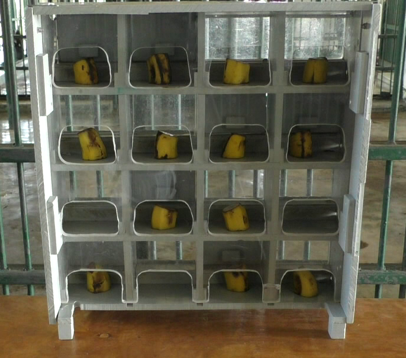
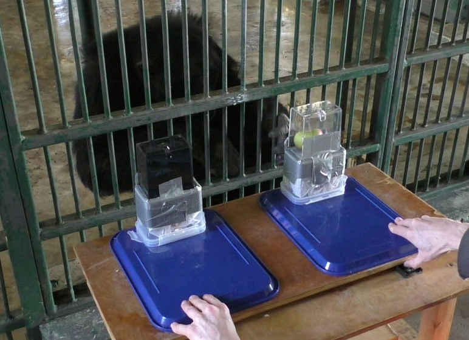
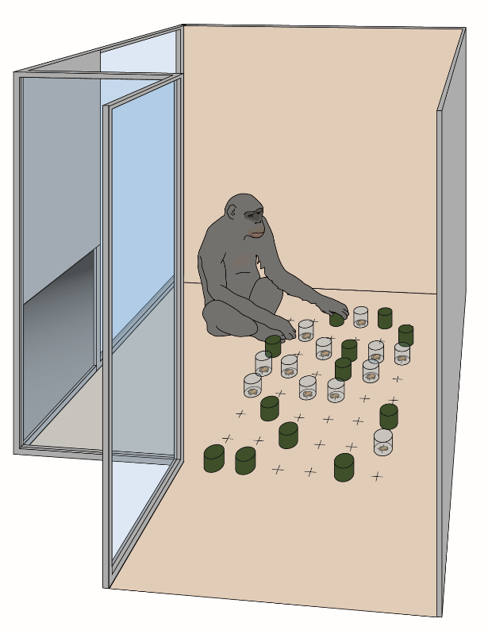
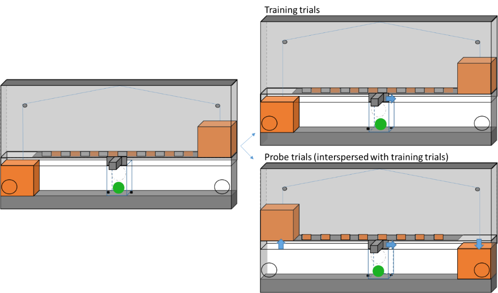

```{r setup, include=FALSE}
knitr::opts_chunk$set(echo = TRUE)

rm(list=ls())
library(lme4)
library(readr)
library(tidyverse)
library(sjPlot)
library(ggthemes)
library(gridExtra)
library(ggpubr)
library(corrr)
library(reshape2)
library(trimr)
library(summarytools)
#library(Hmisc)
#library("PerformanceAnalytics")
source("C:/Users/voelterc/R/R scripts/Roger/diagnostic_fcns.r")
source("C:/Users/voelterc/R/R scripts/Roger/glmm_stability.r")
source("C:/Users/voelterc/R/R scripts/Roger/boxplotteR.r")
source("C:/Users/voelterc/R/R scripts/Roger/boot_glmm.r")
source("C:/Users/voelterc/R/R scripts/Roger/corr_exact.r")
#load(file ="mm1_mult_poss.RData")
#readRDS(file ="multpos_model.rds")
```


```{r loading data, include = FALSE}
#Preparing code for mixed modeling. 
Inh.grid.data <- read.table(file="data/20200119_Inhibition_grid_data.txt", header=T, sep="\t")
Inh.cylinders.data <- read.table(file="data/20200119_Inhibition_cylinders_data.txt", header=T, sep="\t")
Inh.boxes.data <- read.table(file="data/20200119_Inhibition_boxes_data.txt", header=T, sep="\t")

```


```{r loading stop signal data, include = FALSE}

orig.stop.signal.data <- read.table(file="../StopSignal/data/20200126_StopSignal_final.txt", header=T, sep="\t") %>%
  filter(Subject != "Julia") %>% #did not complete test trials
  filter(condition=="test") %>%
  filter(firsttest_trial_number != 1) %>%
  mutate(first_move_correct = recode(first_move_correct, 'c' = 1, 'i' = 0)) %>%
  filter(Change_latency_value > 100) %>%
  droplevels()
  
stop.signal.data2 <- orig.stop.signal.data %>%
  mutate(participant = Subject) %>%
  mutate(rt = Change_latency_value) %>%
  mutate(accuracy = first_move_correct) %>%
  mutate(accuracy = recode(accuracy, 'c' = 1, 'i' = 0))
 
#remove outliers 
trimmed.stop.signal.data <- sdTrim(data = stop.signal.data2, minRT = 150, sd = 2, 
                      perCondition = FALSE, perParticipant = TRUE, 
                      returnType = "mean", digits = 0)

stop.signal_individual2 <- orig.stop.signal.data %>%
  filter(!is.na(Change_latency_value)) %>%
  group_by(Subject) %>% 
  summarize(StopSignal_change_latency = mean(Change_latency_value))

trimmed.stop.signal.data <- trimmed.stop.signal.data %>%
  mutate(Subject=stop.signal_individual2$Subject)

 stop.signal_individual3 <- orig.stop.signal.data %>%
  filter(!is.na(Change_position_value)) %>%
  filter(Change_position_value>-1) %>%
  filter(Change_position_value<26) %>%
  group_by(Subject) %>% 
  summarize(StopSignal_change_position = mean(Change_position_value))


stop_signal_data <- stop.signal_individual2 %>% 
  full_join(trimmed.stop.signal.data )%>%
  full_join(stop.signal_individual3 )%>%  
  mutate(StopSignal_trimmed_change_latency=test)%>%
  select(-participant, -test, -StopSignal_change_position, -StopSignal_change_latency)


```


### Stop-signal Notes
#### Uganda: 
* One trial excluded due to apparatus malfunction (Sarah, test trial). 
* Start position latency: Ten further test trials excluded due to data recording errors. In total, 11/ 305 test trials were removed (3.6%). 
* Change latency: One further test trial excluded due to data recording errors. In total, 2 /305 test trials were removed(0.7%).
* Change position: Ten further test trials excluded due to data recording errors. In total, 11/ 305 test trials were removed (3.6%).
* Training trials: 8 / 1183 (0.7 %) excluded duto data recording errors

#### Kenya 
* Start position latency: Five test trials excluded due to data recording errors. In total, 5/ 322 test trials were removed (1.6%). 
* Change latency: Two test trial excluded due to data recording errors. In total, 2 /322 test trials were removed(0.6%).
* Change position: Zero test trials excluded due to data recording errors. 
* Training trials: 11 / 1306 (0.8 %) excluded duto data recording errors


```{r include=FALSE, eval=FALSE}
summary(Inh.boxes.data  )
table(Inh.boxes.data$Subject,Inh.boxes.data$correct)

view(dfSummary(Inh.boxes.data ))

summary(Inh.cylinders.data  )
table(Inh.cylinders.data$Subject,Inh.cylinders.data$open_cylinder)

view(dfSummary(Inh.cylinders.data   ))


summary(Inh.grid.data )
table(Inh.grid.data$Subject,Inh.grid.data$correct)

view(dfSummary(Inh.grid.data ))

summary(orig.stop.signal.data)


view(dfSummary(orig.stop.signal.data ))
```


## Summary  

* Evidence for a __prepotent response__: Below-chance performance in the inhibition boxes task but not the other tasks. Significant improvement in performance between the first and the second session in the Inhibition Boxes and Inhibition Cylinders task but not the Inhibition Grid task.  

* **Stop-signal task**: Individuals are more likely to move the handle in the correct direction when there is no change in direction from the previous trial. In test trials, we find substantial variation in the latency to change the direction in response to the reversal of the stop-boxes.   

* **Candidate DVs**: Session 1 performance (proportion correct)

***   


```{r preparing data for correlation, include=FALSE}

###boxes
Inh.boxes_individual <- Inh.boxes.data %>%
  filter(!is.na(correct)) %>%
  group_by(Subject) %>% 
  summarize(Inh.boxes.correct = mean(correct)) 

Inh.boxes_individual1 <- Inh.boxes.data %>%
  filter(!is.na(correct)) %>%
  filter(Session==1)%>%
  group_by(Subject) %>% 
  summarize(Inh.boxes.correct1 = mean(correct)) 

Inh.boxes_individual2 <- Inh.boxes.data %>%
  filter(!is.na(correct)) %>%
  filter(Session==2)%>%
  group_by(Subject) %>% 
  summarize(Inh.boxes.correct2 = mean(correct)) 

Inh.boxes_individual_first_trial<- Inh.boxes.data %>%
  filter(Session==1)%>%
  filter(trial_number==1)%>%
  group_by(Subject) %>% 
  summarize(Inh.boxes.first.trial = mean(correct))


###Grid
Inh.grid_individual <- Inh.grid.data %>%
  filter(!is.na(correct)) %>%
  filter(Subject != "Edvard") %>%
  group_by(Subject) %>% 
  summarize(Inh.grid.correct = mean(correct)) 

Inh.grid_individual1 <- Inh.grid.data %>%
  filter(!is.na(correct)) %>%
  filter(Subject != "Edvard") %>%
  filter(Session==1)%>%
  group_by(Subject) %>% 
  summarize(Inh.grid.correct1 = mean(correct))

Inh.grid_individual_first_trial <- Inh.grid.data %>%
  filter(!is.na(correct)) %>%
  filter(Subject != "Edvard") %>%
  filter(Session==1)%>%
  filter(trial_number==1)%>%
  group_by(Subject) %>% 
  summarize(Inh.grid.first.trial = mean(correct)) 

Inh.grid_individual2 <- Inh.grid.data %>%
  filter(!is.na(correct)) %>%
  filter(Subject != "Edvard") %>%
  filter(Session==2)%>%
  group_by(Subject) %>% 
  summarize(Inh.grid.correct2 = mean(correct)) 

###Cylinders

Inh.cylinders_individual <- Inh.cylinders.data %>%
  filter(!is.na(open_cylinder)) %>%
  filter(Subject != "George" & Subject != "Jane" & Subject != "Edvard")%>%
  group_by(Subject) %>% 
  summarize(Inh.cylinders.correct= mean(open_cylinder)) 

Inh.cylinders_individual_session1 <- Inh.cylinders.data %>%
  filter(!is.na(open_cylinder)) %>%
  filter(Subject != "George" & Subject != "Jane" & Subject != "Edvard")%>%
  filter(Session==1)%>%
  group_by(Subject) %>% 
  summarize(Inh.cylinders.correct1= mean(open_cylinder))

Inh.cylinders_individual_session1.t1 <- Inh.cylinders.data %>%
  filter(!is.na(open_cylinder)) %>%
  filter(Subject != "George" & Subject != "Jane" & Subject != "Edvard")%>%
  filter(Session==1)%>%
  filter(trial_number==1)%>%
  group_by(Subject) %>% 
  summarize(Inh.cyl.t1 = mean(open_cylinder)) 

Inh.cylinders_individual_session2 <- Inh.cylinders.data %>%
  filter(!is.na(open_cylinder)) %>%
  filter(Subject != "George" & Subject != "Jane" & Subject != "Edvard")%>%
  filter(Session==2)%>%
  group_by(Subject) %>% 
  summarize(Inh.cylinders.correct2= mean(open_cylinder))

#######################################################
#Join DVs together

Inh_task_individual <- Inh.grid_individual  %>% 
  full_join(Inh.grid_individual1) %>%
  full_join(Inh.grid_individual2) %>%
  full_join(stop_signal_data) %>%
  full_join(Inh.cylinders_individual)%>%
  full_join(Inh.cylinders_individual_session1)%>%
  full_join(Inh.cylinders_individual_session2)%>%
  full_join(Inh.boxes_individual)%>%
  full_join(Inh.boxes_individual1)%>%
  full_join(Inh.boxes_individual2)

```

```{r echo=FALSE}

###Inhibition Grid

plot.Inh.grid_individual <- Inh.grid.data %>%
  filter(!is.na(correct)) %>%
  filter(Subject != "Edvard") %>%
  group_by(Session, Subject) %>% 
  summarize(Inh.grid.correct = mean(correct)) %>%
  add_count(Inh.grid.correct)

 
p1<-  
  ggplot(
  data=plot.Inh.grid_individual, aes(x=c(rep(1, 54),rep(2,54)), y=Inh.grid.correct, group=Session)) +
  geom_boxplot()+
  ylim(0,1)+
  #xlim(0,2)+
  geom_point(size = plot.Inh.grid_individual$n,colour = "blue", alpha=0.1) +
  geom_line(aes(group=Subject),lty=2, alpha=0.4, colour="darkgrey")+
#  geom_line(lty=2)+
  labs(x="",y="Mean number of correct choices")+
  theme_few()+
  theme(axis.text.x=element_blank(), axis.ticks.x=element_blank())+
  ggtitle("Inhibition Grid")+
  geom_hline(yintercept=6/13, linetype="dashed", color = "red")


###Inhibition Cylinders

plot.Inh.cylinders_individual <- Inh.cylinders.data %>%
  filter(!is.na(open_cylinder)) %>%
  filter(Subject != "George" & Subject != "Jane" & Subject != "Edvard")%>%
  group_by(Session, Subject) %>% 
  summarize(Inh.cylinders.correct= mean(open_cylinder))  %>%
  add_count(Inh.cylinders.correct)

 
p2<-  
  ggplot(
  data=plot.Inh.cylinders_individual, aes(x=c(rep(1, 52),rep(2,52)), y=Inh.cylinders.correct, group=Session)) +
  geom_boxplot()+
  ylim(0,1)+
  #xlim(0,2)+
  geom_point(size = plot.Inh.cylinders_individual$n, colour = "blue", alpha=0.1) +
  geom_line(aes(group=Subject),lty=2, alpha=0.4, colour="darkgrey")+
#  geom_line(lty=2)+
  labs(x="",y="Mean number of correct choices")+
  theme_few()+
  theme(axis.text.x=element_blank(), axis.ticks.x=element_blank())+
  ggtitle("Inhibition Cylinders")+
  geom_hline(yintercept=0.5, linetype="dashed", color = "red")


###Inhibition Boxes

plot.Inh.boxes_individual <- Inh.boxes.data %>%
  filter(!is.na(correct)) %>%
  group_by(Session, Subject) %>% 
  summarize(Inh.boxes.correct= mean(correct))  %>%
  add_count(Inh.boxes.correct)

 
p3<-  
  ggplot(
  data=plot.Inh.boxes_individual, aes(x=c(rep(1, 53),rep(2,53)), y=Inh.boxes.correct, group=Session)) +
  geom_boxplot()+
  ylim(0,1)+
  #xlim(0,2)+
  geom_point(size = plot.Inh.boxes_individual$n, colour = "blue", alpha=0.1) +
  geom_line(aes(group=Subject),lty=2, alpha=0.4, colour="darkgrey")+
  labs(x="",y="Mean number of correct choices")+
  theme_few()+
  theme(axis.text.x=element_blank(), axis.ticks.x=element_blank())+
  ggtitle("Inhibition Boxes")+
  geom_hline(yintercept=0.5, linetype="dashed", color = "red")


grid.arrange(p1, p2,p3, nrow = 1, heights=unit(100, "mm"))

```
  
* Dashed line: chance level  
* Larger values indicate better performance in all three tasks / DVs  

*** 
\pagebreak  


## Inhibition Grid  

### Methods  

#### Materials  
We use a sliding platform attached to the wall of the enclosure and an apparatus (flap-door box; h x w x d: 48 cm x 45 cm x 16 xm) with 16 compartments (4 x 4) with opaque and transparent flap doors (10 cm x 7 cm). The apparatus will be fixed on top of the sliding platforms. All compartments of the apparatus can be baited via the back of the apparatus.
In the inhibition task, six transparent and seven opaque doors are arranged on the grid. All of these 13 compartments are baited outside the subject’s view at the beginning of a trial with a quarter piece of banana. The transparent doors (but not the opaque doors) are blocked (by means of a screw) and cannot be opened. Subjects can obtain rewards behind opaque flap-doors.


```{r inh_grid_setup, fig.cap="Flap-door apparatus with transparent and opaque doors.", echo=FALSE}


``` 


#### Procedure  
At the beginning of each session, the experimenter allocates seven opaque and six transparent flap-doors behind an occluder onto the apparatus (the position of the flap-doors varies in a pseudo-random and prefixed order). The compartments behind the flap-doors are baited with a reward. After the baiting, E pushes the sliding platform forward and subjects are allowed to search for food unrestrictedly (max 10 minutes). Once an individual stops interacting with the apparatus for 1 min E pulls the apparatus back and terminates the session. 
Subjects will complete two sessions with one trial each. In each quadrant of the grid there will always be at least one transparent and one opaque flap door. The exact location of the opaque and transparent flap doors will be randomized across trials. All subjects will receive the same configurations and the same order of configurations. 

#### Scoring
We code the order of the touched flap doors, whether the flap door is opaque or transparent, and whether the subject has touched the same door before within the same session. 
We score the number of mistakes within the first six flap doors that subjects touch (not considering repeated choices) within a session (0 – 24).

### Results  

* DV: mean correct choices within the first six unique doors that were touched by the subjects (not considering repeated choices)  
* Comparison to chance: 0.54 (7/13)  

#### First trial performance 

```{r echo=FALSE}
b1<-binom.test(x=sum(Inh.grid_individual_first_trial$Inh.grid.first.trial),n=length(Inh.grid_individual_first_trial$Inh.grid.first.trial), p=7/13)

```
* First trial correct vs chance value (7/13) in the **first trial of Session 1**: Number of individuals: `r b1$parameter`, Number of successes: `r round(b1$statistic,2)`, Mean = `r round(b1$estimate, 2)`, 95% CI [`r round(b1$conf.int[1],2)`, `r round(b1$conf.int[2],2)`], *p*=`r round(b1$p.value,3)`  


#### Session performance

```{r echo=FALSE}
tt<-t.test(Inh_task_individual$Inh.grid.correct1 , mu=7/13, alternative = "two.sided")
sd(Inh_task_individual$Inh.grid.correct1, na.rm=TRUE)
```
* Mean correct vs chance value (7/13) in **Session 1**: Mean = `r round(tt$estimate, 2)`, 95% CI [`r round(tt$conf.int[1],2)`, `r round(tt$conf.int[2],2)`], *t*(`r tt$parameter`)=`r round(tt$statistic,2)`, *p*=`r round(tt$p.value,3)`  

```{r echo=FALSE}
tt<-t.test(Inh_task_individual$Inh.grid.correct2 , mu=7/13, alternative = "two.sided")
sd(Inh_task_individual$Inh.grid.correct2, na.rm=TRUE)
```
* Mean correct vs chance value (7/13) in **Session 2**: Mean = `r round(tt$estimate, 2)`, 95% CI [`r round(tt$conf.int[1],2)`, `r round(tt$conf.int[2],2)`], *t*(`r tt$parameter`)=`r round(tt$statistic,2)`, *p*=`r round(tt$p.value,3)`  

#### Session 1 vs Session 2

```{r echo=FALSE}
tt<-t.test(Inh_task_individual$Inh.grid.correct1, Inh_task_individual$Inh.grid.correct2, paired = TRUE, alternative = "two.sided")

```
* Mean correct in session 1 vs session 2: Mean difference = `r round(tt$estimate, 2)`, 95% CI [`r round(tt$conf.int[1],2)`, `r round(tt$conf.int[2],2)`], *t*(`r tt$parameter`)=`r round(tt$statistic,2)`, *p*=`r round(tt$p.value,3)`

###### Correlation between Session 1 and 2  
```{r  echo=FALSE}
corre<-cor.test(Inh_task_individual$Inh.grid.correct1, Inh_task_individual$Inh.grid.correct2)
```
* Test-retest reliability: Pearson correlation between session 1 and session 2 performance: Correlation coefficient = `r round(corre$estimate, 2)`, 95% CI [`r round(corre$conf.int[1],2)`, `r round(corre$conf.int[2],2)`], *t*(`r corre$parameter`)=`r round(corre$statistic,2)`, *p*=`r round(corre$p.value,3)`


***  

## Inhibition Boxes

### Methods  

#### Materials  
We use a sliding platform on top of a table outside the enclosure and two boxes made of Perspex (h x w x d: 21 cm x 16 cm x 10 cm), one transparent and one opaque. Each box is fixated to top of a small plastic tray (d x w: 35 cm x 27 cm).  Besides we use an occluder for the baiting of the boxes. The boxes contain two compartments. In the lower compartment (h x w x d: 11 cm x 16 cm x 10 cm) filling material (toilet paper) serves as potential hiding place for the food reward (1/16 apple piece). The filling material can be extracted though an opening in the front side of the boxes (3 x 3 cm). The upper compartment (h x w x d: 10 cm x 10 cm x 6.5 cm) is only visible in the transparent box. There will be a piece of food (1/2 apple) on the intermediate ceiling in the upper compartment lays inaccessible to the subject. The opaque box always contains a reward hidden in the filling material that can be obtained by removing the filling material. 

```{r inh_boxes_setup, fig.cap="Glass-ceiling box setup.", echo=FALSE}


```


#### Procedure  
Subjects can choose between an opaque and a transparent box. The transparent box contains a visible piece of food on top of the transparent intermediate ceiling (i.e., this food item is inaccessible). Subjects need to learn to choose the opaque box in order to retrieve the accessible piece of food inside the opaque box.
At the beginning of each trial, E baits both boxes behind an occluder. The lower compartment of both boxes is filled with paper. Subsequently, E places a food item inside the paper in the opaque box, as well as on the transparent intermediate ceiling inside of the transparent box. After the baiting, E removes the occluder and pushes the sliding platform forward and the subject is allowed to make a choice. The subject can now remove the paper and the food from the chosen box (if the correct box was chosen). Subjects complete 24 trials within two sessions (12 trials per session). If subjects choose incorrectly the experimenter will not reveal the location of the food reward in the opaque box. The location of the transparent and opaque boxes will be counterbalanced across trials and they will stay on the same side for a maximum of three consecutive trials. All subjects will receive the same order of trials (with respect to the location of the food in each trial).  

#### Scoring  
A choice is coded as soon as the subject touched one of the boxes. We score whether subjects selected (i.e., point toward or touch) the correct (opaque) or incorrect (transparent) box. With 24 trials, the number of mistakes can vary between 0 and 24.


### Results  

* DV: mean performance of correct choices (within 12 trials per session)  
* Chance value: 0.5  

#### First trial performance

```{r}

b1<-binom.test(x=sum(Inh.boxes_individual_first_trial$Inh.boxes.first.trial),n=length(Inh.boxes_individual_first_trial$Inh.boxes.first.trial), p=0.5)

```


#### Session performance


```{r echo=FALSE}
tt<-t.test(Inh_task_individual$Inh.boxes.correct1 , mu=0.5, alternative = "two.sided")
sd(Inh_task_individual$Inh.boxes.correct1, na.rm = TRUE)
```
* Mean correct vs chance value (0.5) in **Session 1**: Mean = `r round(tt$estimate, 2)`, 95% CI [`r round(tt$conf.int[1],2)`, `r round(tt$conf.int[2],2)`], *t*(`r tt$parameter`)=`r round(tt$statistic,2)`, *p*=`r round(tt$p.value,3)` 


```{r echo=FALSE}
tt<-t.test(Inh_task_individual$Inh.boxes.correct2 , mu=0.5, alternative = "two.sided")
sd(Inh_task_individual$Inh.boxes.correct2, na.rm=TRUE)

```
* Mean correct vs chance value (0.5) in **Session 2**: Mean = `r round(tt$estimate, 2)`, 95% CI [`r round(tt$conf.int[1],2)`, `r round(tt$conf.int[2],2)`], *t*(`r tt$parameter`)=`r round(tt$statistic,2)`, *p*=`r round(tt$p.value,3)` 

#### Session 1 vs Session 2

```{r echo=FALSE}
tt<-t.test(Inh_task_individual$Inh.boxes.correct1, Inh_task_individual$Inh.boxes.correct2, paired = TRUE, alternative = "two.sided")

```
* Mean correct in session 1 vs session 2: Mean difference = `r round(tt$estimate, 2)`, 95% CI [`r round(tt$conf.int[1],2)`, `r round(tt$conf.int[2],2)`], *t*(`r tt$parameter`)=`r round(tt$statistic,2)`, *p*=`r round(tt$p.value,3)`

###### Correlation between Session 1 and 2  
```{r  echo=FALSE}
corre<-cor.test(Inh_task_individual$Inh.boxes.correct1, Inh_task_individual$Inh.boxes.correct2)
```
* Test-retest reliability: Pearson correlation between session 1 and session 2 performance: Correlation coefficient = `r round(corre$estimate, 2)`, 95% CI [`r round(corre$conf.int[1],2)`, `r round(corre$conf.int[2],2)`], *t*(`r corre$parameter`)=`r round(corre$statistic,2)`, *p*=`r round(corre$p.value,3)`

###### Side biases in Session 1 and 2  

```{r echo=FALSE}
plot.Inh.boxes_individual_side <- Inh.boxes.data %>%
  filter(!is.na(same_side_as_before)) %>%
  group_by(Session, Subject) %>% 
  summarize(Inh.boxes.side= mean(same_side_as_before))  %>%
  add_count(Inh.boxes.side)

 
p.boxes.side<-  
  ggplot(
  data=plot.Inh.boxes_individual_side, aes(x=c(rep(1, 53),rep(2,53)), y=Inh.boxes.side, group=Session)) +
  geom_boxplot()+
  ylim(0,1)+
  geom_point(size = plot.Inh.boxes_individual_side$n, colour = "blue", alpha=0.1) +
  geom_line(aes(group=Subject),lty=2, alpha=0.4, colour="darkgrey")+
  labs(x="",y="Proportion of same side choices")+
  theme_few()+
  theme(axis.text.x=element_blank(), axis.ticks.x=element_blank())+
  ggtitle("Inhibition Boxes: side biases")

p.boxes.side
```


## Inhibition Cylinders  

### Methods  

#### Materials  
We distribute 24 polycarbonate cylinders (height x diameter: 4 cm x 6 cm) on the floor of the enclosure on a 6x8 grid which covers an area of 120 x 150 cm. The distance between adjacent cylinders on the grid is ca 20 cm. There are two types of cylinders: 12 transparent and 12 opaque (green) cylinders. The distribution of the cylinders on the grid is pseudo-random with the restriction that there are two cylinders of each type in any of the eight columns of the grid. 
The transparent cylinders are sealed and contain visible but inaccessible food rewards (a peanut inside its shell). The opaque cylinders are open (they do not have a bottom) and baited with the same type of food. Two cameras are used to videotape chimpanzees’ search behaviour.

```{r inh_cylinders_setup, fig.cap="Cylinders inhibition task setup.", echo=FALSE}


```  


#### Procedure  
At the beginning of a session the subject enters the room with the array of 24 cylinders. Subjects can then interact with the cylinders and retrieve the food for a maximum of 10 minutes. If subjects lift at least 12 cylinders the session is stopped after 5 minutes or when the subject do not lift a cylinder for 30 sec (after they have initiated the search) or earlier if a subject throws the cylinders around without looking for the food (e.g. during dominance display). At the end of a session, subjects are moved to the adjacent compartment. 
Subjects complete two sessions in total and one session per day. If an individual throws the cylinders around the session is repeated on the next day. The cylinders will be distributed pseudo-randomly with the restriction that two opaque and two transparent cylinders will be in each row of the search array. Every individual will receive the same distribution of cylinders.  

#### Scoring  
We code the order of the cylinders lifted by the subject, whether the cylinders are baited and whether the subject has lifted the same cylinder before within the same session. Cylinders that were thrown around and not lifted or turned over one by one are not considered. 
We score the number of mistakes within the first 12 lifted cylinders (not considering repeated choices) within each session (0 – 12). With two sessions, the number of mistakes can vary between 0 and 24.


### Results  

* DV: mean correct choices (toward opaque cylinders) within the first 12 lifted cylinders (per session) not considering repeated choices  
* Chance value: 0.5

#### First trial performance 

```{r echo=FALSE}
b1<-binom.test(x=sum(Inh.cylinders_individual_session1.t1$Inh.cyl.t1),n=length(Inh.cylinders_individual_session1.t1$Inh.cyl.t1), p=0.5)

```


#### Session performance

```{r echo=FALSE}
tt<-t.test(Inh_task_individual$Inh.cylinders.correct1 , mu=0.5, alternative = "two.sided")
sd(Inh_task_individual$Inh.cylinders.correct1, na.rm=TRUE )
```
* Mean correct vs chance value (0.5) in **Session 1**: Mean = `r round(tt$estimate, 2)`, 95% CI [`r round(tt$conf.int[1],2)`, `r round(tt$conf.int[2],2)`], *t*(`r tt$parameter`)=`r round(tt$statistic,2)`, *p*=`r round(tt$p.value,3)` 


```{r echo=FALSE}
tt<-t.test(Inh_task_individual$Inh.cylinders.correct2 , mu=0.5, alternative = "two.sided")
sd(Inh_task_individual$Inh.cylinders.correct2 , na.rm=TRUE)
```
* Mean correct vs chance value (0.5) in **Session 2**: Mean = `r round(tt$estimate, 2)`, 95% CI [`r round(tt$conf.int[1],2)`, `r round(tt$conf.int[2],2)`], *t*(`r tt$parameter`)=`r round(tt$statistic,2)`, *p*=`r round(tt$p.value,3)` 

#### Session 1 vs Session 2

```{r echo=FALSE}
tt<-t.test(Inh_task_individual$Inh.cylinders.correct1, Inh_task_individual$Inh.cylinders.correct2, paired = TRUE, alternative = "two.sided")

```
* Mean correct in session 1 vs session 2: Mean difference = `r round(tt$estimate, 2)`, 95% CI [`r round(tt$conf.int[1],2)`, `r round(tt$conf.int[2],2)`], *t*(`r tt$parameter`)=`r round(tt$statistic,2)`, *p*=`r round(tt$p.value,3)`

###### Correlation between Session 1 and 2  
```{r  echo=FALSE}
corre<-cor.test(Inh_task_individual$Inh.cylinders.correct1, Inh_task_individual$Inh.cylinders.correct2)
```
* Test-retest reliability: Pearson correlation between session 1 and session 2 performance: Correlation coefficient = `r round(corre$estimate, 2)`, 95% CI [`r round(corre$conf.int[1],2)`, `r round(corre$conf.int[2],2)`], *t*(`r corre$parameter`)=`r round(corre$statistic,2)`, *p*=`r round(corre$p.value,3)`


***

\pagebreak  

## Stop-signal Task  

### Methods  

#### Materials  
The apparatus is a polycarbonate enclosure (measures: w x h x d: 68.5 x 47.5 x 7 cm). The upper part of the front side (containing the electronic mechanism) is opaque; the lower part is transparent allowing subjects to see food inside the apparatus. The lower part of the apparatus front contains two circular openings, the reward openings, on both sides and a continuous slot that allows subjects to move a slider along the entire width of the apparatus. The slider is a piece of polycarbonate protruding through the slot in the front side of the apparatus. Inside the apparatus the slider is attached to the reward container. By moving the slider to the left or the right the reward inside the container can be moved to one of the reward openings, where the reward (a peanut) can be extracted from the apparatus. The backside of the apparatus contains a central opening that allows the experimenter to bait the reward container if the container is positioned in the centre of the apparatus. There is a string attached to the reward container that allows the experimenter to re-centre the container by pulling it from the backside of the apparatus. 
The apparatus contains two servo motors and counter-weighted boxes which are used to open and close the reward openings (stop boxes).  A pressure sensitive linear resistor (SoftPot membrane potentiometer) is used to measure the position of the reward box and a LED strip is used as a visual signal. The LED strip is placed directly above the slider (in the opaque part of the apparatus); when switched on, the LED strip indirectly illuminates the visible interior (from the subject’s perspective) of the apparatus. A microcontroller (Arduino Uno / Adafruit motor shield) has been programed to read the box position and open and close the reward openings accordingly while illuminating the LED strip.  Servo motors are turned to drop the boxes into place, which blocks the slider and the access to the reward openings for the subject.  
The motor shield / microcontroller is powered with a 12V AC-to-DC adapter. A laptop is connected to the microcontroller via the USB port. A button box connected via a cable to the microcontroller allows E to lift or drop the stop boxes before each trial and to activate the automatic change of the stop-box configuration when the subject is moving the reward container from its initial central location.
 
```{r inh_ss_setup, fig.cap="Stop-box apparatus", echo=FALSE}


``` 

#### Procedure  
In every trial, one of the reward openings is open whereas the other one is blocked by a stop box. E determines the configuration of the stop boxes before the onset of a trial. At the beginning of each trial, E places the reward inside the centred reward container. Subjects need to move the slider in the front of the apparatus to an unblocked opening in the front side of the apparatus to retrieve the reward inside the reward container. In training trials, the subject needs to move the slider to the reward opening that is open at the start of the trial. In test trials, the configuration of the stop boxes changes once the subject starts to move the slider toward the open reward opening. When this happens, one stop box is dropped and blocks the initially open hole whereas the other stop box is lifted to unblock the other reward opening. Once the change in the box configuration is triggered the whole slider area will be illuminated for 2 seconds. To extract the reward the subject needs to correct the initial direction of the slider and move it to the other side of the apparatus. There is only one change in the stop-box configuration per (test) trial.
Subjects will receive two sessions of 30 trials each. At the beginning of each session there will be six training trials (without a change in the stop-box configuration after the onset of a trial). After the initial training trials, there will be six blocks of four trials each per session. Each block will include three training and one test trial (with a change in box configuration). The correct side where the food can be retrieved is counterbalanced within each block and the correct side will be counterbalanced across training and test trials. All subjects will receive the same order of trials.

#### Scoring  
We record the following variables directly via the serial connection between the Arduino Uno microcontroller and a PC outside the enclosure: in all trials, we record whether the first movement of the slider is to the correct side or incorrect side (based on the configuration at the onset of the trial). Additionally, we record in training trials the latency from the first movement to the endpoint of the SoftPot membrane potentiometer (ca. 22 cm from the starting position) and the latency between baiting the apparatus and the first move of the slider. In the test trials, we record the latency after the stop signal has been triggered to change the direction of the slider, the distance the slider has been moved further in the incorrect direction after the stop signal has been triggered until subjects have changed the direction of the slider, and the latency between the triggering of the stop signal until the slider reached the starting point again. 
The key variable we will use as a measure of response inhibition is the latency to change direction in test trials.


### Results  


```{r loading stopsignal data, include = FALSE}
#Preparing code for mixed modeling. 
all.data <- read.table(file="../StopSignal/data/20200126_StopSignal_final.txt", header=T, sep="\t") %>%
  filter(Subject != "Julia") %>% #did not complete test trials
  mutate(first_move_correct = recode(first_move_correct, 'c' = 1, 'i' = 0))

#filter(Change_latency_value < 3001 & Change_latency_value > 100)%>%
  #filter(X_firsttest_trial_number != 1)

```


#### Trial-to-trial effects

* DV: mean proportion of first moves toward correct side  

```{r echo=FALSE}

###Plotting side_changes
plot_individual_side <- all.data %>%
  filter(side_change!="") %>%
  filter(!is.na(first_move_correct)) %>%
  group_by(condition, side_change, Subject) %>% 
  summarize(correct_resp = mean(first_move_correct)) 


plot_ind_training_side <- plot_individual_side %>% 
  filter(condition == "training") %>%
  add_count(correct_resp)

plot_ind_training_side_mean <- plot_ind_training_side %>% 
  group_by(side_change) %>% 
  summarize(mean_correct = mean(correct_resp)) 

p1 <- ggplot(
  data=plot_ind_training_side, aes(side_change, correct_resp, group = Subject)) +   
  geom_point(size = plot_ind_training_side$n, colour = "blue", alpha=0.1) +
  geom_line(lty=2,colour="darkgrey")+
  ylim(0,1)+
  labs(x="Side Change",y="Mean correct")+
  theme_few()+
  #scale_y_continuous(breaks=seq(0,1,0.25))+
  ggtitle("training")+
  geom_segment(aes(y = plot_ind_training_side_mean$mean_correct[1], yend = plot_ind_training_side_mean$mean_correct[1], x = 1 -0.2, xend = 1 + 0.2))+
  geom_segment(aes(y = plot_ind_training_side_mean$mean_correct[2], yend = plot_ind_training_side_mean$mean_correct[2], x = 2 -0.2, xend = 2 + 0.2))+
  stat_compare_means(aes(group = side_change), paired = TRUE, method="t.test", label.x = 1.3)#, label = "p.signif")


plot_ind_test_side <- plot_individual_side %>% 
  filter(condition == "test") %>%
  add_count(correct_resp)

plot_ind_test_side_mean <- plot_ind_test_side %>% 
  group_by(side_change) %>% 
  summarize(mean_correct = mean(correct_resp)) 

p2 <- ggplot(
  data=plot_ind_test_side, aes(side_change, correct_resp, group = Subject)) +   
  geom_point(size = plot_ind_test_side$n, colour = "blue", alpha=0.05) +
  geom_line(lty=2, colour="darkgrey")+
  ylim(0,1)+
  labs(x="Side Change",y="Mean correct")+
  theme_few()+
  #scale_y_continuous(breaks=seq(0,1,0.25))+
  ggtitle("test")+
  geom_segment(aes(y = plot_ind_test_side_mean$mean_correct[1], yend = plot_ind_test_side_mean$mean_correct[1], x = 1 -0.2, xend = 1 + 0.2))+
  geom_segment(aes(y = plot_ind_test_side_mean$mean_correct[2], yend = plot_ind_test_side_mean$mean_correct[2], x = 2 -0.2, xend = 2 + 0.2))+
  stat_compare_means(aes(group = side_change), paired = TRUE, method="t.test", label.x = 1.3)#, label = "p.signif")


grid.arrange(p1, p2, nrow = 1)
 g <- arrangeGrob(p1, p2, nrow = 1)
ggsave("graphics/stopsignal_trial to trial_correct.jpeg",g, width = 10, height = 6)


```


```{r echo=FALSE}
tt<-t.test( plot_ind_training_side[plot_ind_training_side$side_change=="no",]$correct_resp, plot_ind_training_side[plot_ind_training_side$side_change=="yes",]$correct_resp, paired = TRUE, alternative = "two.sided")
```

* Effect of side changes on mean proportion of first moves toward correct side in **training trials**: Mean difference = `r round(tt$estimate, 2)`, 95% CI [`r round(tt$conf.int[1],2)`, `r round(tt$conf.int[2],2)`], *t*(`r tt$parameter`)=`r round(tt$statistic,2)`, *p*=`r round(tt$p.value,3)` 

```{r echo=FALSE}
tt<- t.test( plot_ind_test_side[plot_ind_test_side$side_change=="no",]$correct_resp, plot_ind_test_side[plot_ind_test_side$side_change=="yes",]$correct_resp, paired = TRUE, alternative = "two.sided")
```
* Effect of side changes on mean proportion of first moves toward correct side in **test trials**: Mean difference = `r round(tt$estimate, 2)`, 95% CI [`r round(tt$conf.int[1],2)`, `r round(tt$conf.int[2],2)`], *t*(`r tt$parameter`)=`r round(tt$statistic,2)`, *p*=`r round(tt$p.value,3)` 

#### Comparison against chance
* Chance value: 0.5
```{r echo=FALSE}
tt<- t.test( plot_ind_training_side[plot_ind_training_side$side_change=="no",]$correct_resp, mu=0.5, alternative = "two.sided")
```

* Comparison of **no side-change** training trials to chance: Mean difference = `r round(tt$estimate, 2)`, 95% CI [`r round(tt$conf.int[1],2)`, `r round(tt$conf.int[2],2)`], *t*(`r tt$parameter`)=`r round(tt$statistic,2)`, *p*=`r round(tt$p.value,3)` 


```{r echo=FALSE}
tt<-t.test( plot_ind_training_side[plot_ind_training_side$side_change=="yes",]$correct_resp, mu=0.5, alternative = "two.sided")
```
* Comparison of **side-change** training trials to chance: Mean difference = `r round(tt$estimate, 2)`, 95% CI [`r round(tt$conf.int[1],2)`, `r round(tt$conf.int[2],2)`], *t*(`r tt$parameter`)=`r round(tt$statistic,2)`, *p*=`r round(tt$p.value,3)`

```{r echo=FALSE}
tt<- t.test( plot_ind_test_side[plot_ind_test_side$side_change=="no",]$correct_resp, mu=0.5, alternative = "two.sided")
```
* Comparison of **no side-change** test trials to chance: Mean difference = `r round(tt$estimate, 2)`, 95% CI [`r round(tt$conf.int[1],2)`, `r round(tt$conf.int[2],2)`], *t*(`r tt$parameter`)=`r round(tt$statistic,2)`, *p*=`r round(tt$p.value,3)`   

```{r echo=FALSE }
tt<- t.test( plot_ind_test_side[plot_ind_test_side$side_change=="yes",]$correct_resp, mu=0.5, alternative = "two.sided")
```

* Comparison of **side-change** test trials to chance: Mean difference = `r round(tt$estimate, 2)`, 95% CI [`r round(tt$conf.int[1],2)`, `r round(tt$conf.int[2],2)`], *t*(`r tt$parameter`)=`r round(tt$statistic,2)`, *p*=`r round(tt$p.value,3)`  


#### Test trials: change latencies and change positions

```{r loading test data, include = FALSE}
#Preparing code for mixed modeling. 
test.data <- read.table(file="../StopSignal/data/20200126_StopSignal_final.txt", header=T, sep="\t") %>%
  filter(Subject != "Julia") %>% #did not complete test trials
  filter(condition=="test") %>%
  filter(firsttest_trial_number != 1) %>%
  mutate(first_move_correct = recode(first_move_correct, 'c' = 1, 'i' = 0)) %>%
  filter(Change_latency_value > 100) 
  
```

```{r remove outliers, include=FALSE}
test.data2 <- test.data %>%
  mutate(participant = Subject) %>%
  mutate(rt = Change_latency_value) %>%
  mutate(accuracy = first_move_correct) %>%
  mutate(accuracy = recode(accuracy, 'c' = 1, 'i' = 0))
  
trimmed.test.data <- sdTrim(data = test.data2, minRT = 150, sd = 2, 
                      perCondition = FALSE, perParticipant = TRUE, 
                      returnType = "mean", digits = 0)

plot_individual2 <- test.data %>%
  filter(!is.na(Change_latency_value)) %>%
  group_by(Subject) %>% 
  summarize(change_latency = mean(Change_latency_value))

trimmed.test.data <- trimmed.test.data %>%
  mutate(Subject=plot_individual2$Subject)

 plot_individual3 <- test.data %>%
  filter(!is.na(Change_position_value)) %>%
  filter(Change_position_value>-1, Change_position_value<26) %>%
  group_by(Subject) %>% 
  summarize(Change_position = mean(Change_position_value))


plot_individual_trimmed <- plot_individual2 %>% 
  inner_join(trimmed.test.data )%>%
  inner_join(plot_individual3 )%>%  
  mutate(trimmed_change_latency=test)%>%
  add_count(trimmed_change_latency) %>%
  select(-participant, -test)%>%
  rename(n_lat=n)%>%
  add_count(Change_position) %>%
  rename(n_pos=n)


```


```{r echo=FALSE, warning=FALSE}  
  ###Plotting change latency


p1 <- 
  ggplot(
  data=plot_individual_trimmed , aes(x=rep(1, 52), y=trimmed_change_latency))+
  geom_boxplot(outlier.shape = NA)+
  geom_point(size = plot_individual_trimmed$n_lat, colour = "blue", alpha=0.2) +
  #geom_line(lty=2, colour="darkgrey")+
  ylim(0,5000)+
  xlim(0,2)+
  labs(x="",y="Change latency")+
  theme_few()+
  theme(axis.text.x=element_blank(), axis.ticks.x=element_blank())+
  #scale_y_continuous(breaks=seq(0,1,0.25))+
  ggtitle("change latency")

p2 <- 
  ggplot(
  data=plot_individual_trimmed , aes(x=rep(1, 52), y=Change_position))+
  geom_boxplot(outlier.shape = NA)+
  geom_point(size = plot_individual_trimmed$n_pos, colour = "blue", alpha=0.2) +
  #geom_line(lty=2, colour="darkgrey")+
  ylim(0,22)+
  xlim(0,2)+
  labs(x="",y="Change position")+
  theme_few()+
  theme(axis.text.x=element_blank(), axis.ticks.x=element_blank())+
  #scale_y_continuous(breaks=seq(0,1,0.25))+
  ggtitle("change position")


grid.arrange(p1, p2, nrow = 1)
 g <- arrangeGrob(p1, p2, nrow = 1)
ggsave("graphics/stopsignal_test trials.jpeg",g, width = 10, height = 6)
```


***  

## Plotting correlations  


```{r include=FALSE}

d <- correlate(Inh_task_individual[-1], method="pearson")
```

```{r include=FALSE}
#jpeg(file="WM_corrplot.jpeg", width=3800, height=1000, res=300)
#pdf(file="WM_corrplot.pdf", width=10, height=4)
d %>%
  shave(upper = TRUE) %>%
  rplot(print_cor = TRUE, colors = c("red", "green"), shape = 16) 
#dev.off()
#rcorr(as.matrix(WM_task_individual[-1]), type="spearman")

#chart.Correlation(Inh_task_individual[-1], histogram=TRUE, pch=19, method = "spearman")
```

```{r echo=FALSE}
# Get upper triangle of the correlation matrix
  get_upper_tri <- function(cormat){
    cormat[lower.tri(cormat)]<- NA
    return(cormat)
  }

Inh_task_individual_corr <- Inh_task_individual # %>% 
 # select(-Inh.boxes.correct1, -Inh.boxes.correct2, -Inh.cylinders.correct1, -Inh.cylinders.correct2, -Inh.grid.correct1, -Inh.grid.correct2   )
  #select(-StopSignal_trimmed_change_latency)

cormat <- round(cor(Inh_task_individual_corr[-1], method="pearson", use = "pairwise.complete.obs"),2)
upper_tri <- get_upper_tri(cormat)
melted_cormat=melt(cormat, na.rm = TRUE)
ggplot(data = melted_cormat, aes(x=Var1, y=Var2, fill=value)) + 
  geom_tile()+
  geom_text(aes(Var2, Var1, label = value), color = "black", size = 2) +
 scale_fill_gradient2(low = "blue", high = "red", 
   midpoint = 0, limit = c(-1,1), space = "Lab", 
   name=" Pearson Correlation") +
  theme_minimal()+ 
 theme(axis.text.x = element_text(angle = 45, vjust = 1, 
    size = 8, hjust = 1))+
  labs(x="",y="")+
 coord_fixed()

```

```{r echo=FALSE}
knitr::knit_exit()
```

```{r include=FALSE}
library(ggcorrplot)
corr <- cor(Inh_task_individual_corr[-1])
p.mat <- cor_pmat(Inh_task_individual_corr[-1])
ggcorrplot(cormat, hc.order = TRUE,
    type = "lower",  lab=TRUE, insig="pch")

```

```{r include=FALSE}
write.csv(Inh_task_individual_corr, file = "../EF_tasks/Inh_task_individual_corr2020.csv", row.names=FALSE)

demo.data<-Inh.grid.data%>%
  filter(trial_number==1 & Session==1)%>%
  select(Subject, site,Group, Sex, Age)

write.csv(demo.data, file = "../EF_tasks/chimp_demographics.csv", row.names=FALSE)
```
