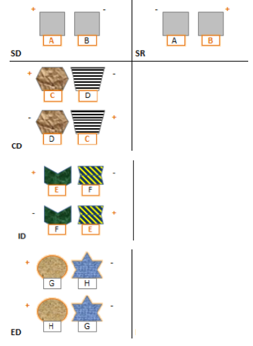
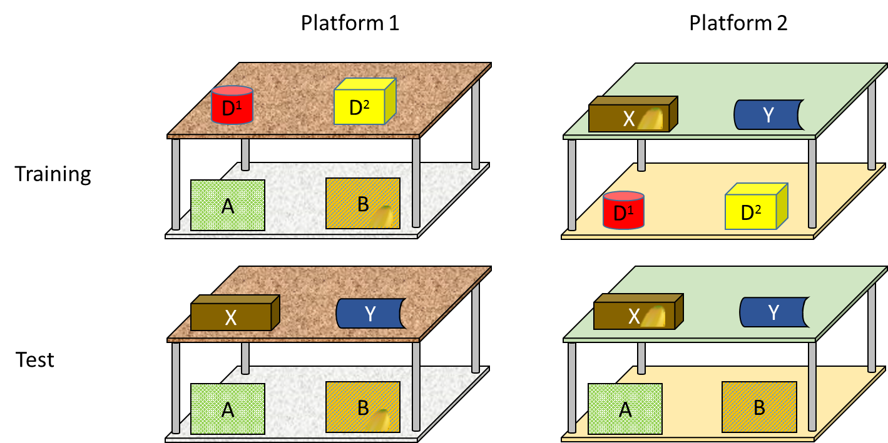
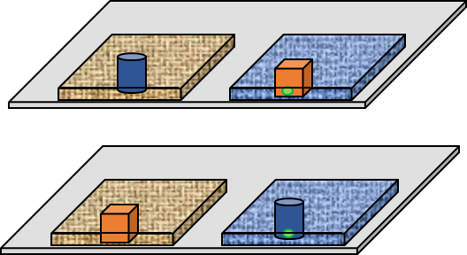

```{r setup, include=FALSE}
knitr::opts_chunk$set(echo = TRUE)

rm(list=ls())
library(lme4)
library(readr)
library(tidyverse)
library(sjPlot)
library(ggthemes)
library(gridExtra)
library(ggpubr)
library(corrr)
library(reshape2)
library(cowplot)
library(trimr)
#library(Hmisc)
#library("PerformanceAnalytics")
source("../../R scripts/Roger/diagnostic_fcns.r")
source("../../R scripts/Roger/glmm_stability.r")
source("../../R scripts/Roger/boxplotteR.r")
source("../../R scripts/Roger/boot_glmm.r")
source("../../R scripts/Roger/corr_exact.r")
#load(file ="mm1_mult_poss.RData")
#readRDS(file ="multpos_model.rds")
```

#### Notes:  
* Shifting boxes: Tess did not receive the simple discrimination reversal phase. George and Saidia did not complete the SD phase.
* Task Switching: Mwanzo failed Training 1 (72 trials), Julia did not finish training 2 (not motivated), Safari did not finish training 1. George and Saidia were not tested.
* Shifting tray: George did not complete the task (he was excluded). Saidia and Safari only completed the first session.  


```{r loading data, include = FALSE}
#Preparing code for mixed modeling. 
Shifting.shelf.data <- read.table(file="data/20200120 TaskSwitching_final Sweetwaters data.txt", header=T, sep="\t") %>%
  filter(Subject != "Julia" & Subject != "Mwanzo" & Subject != "Safari") #did not complete test trials
  
Shifting.boxes.data <- read.table(file="data/20200119 Shifting boxes_final Sweetwaters data.txt", header=T, sep="\t") %>%
  filter(Subject != "George" & Subject != "Saidia") #did not complete test trials
  
Shifting.tray.data <- read.table(file="data/20200119 Shifting_tray_Sweetwaters_final data.txt", header=T, sep="\t") %>%
  filter(Subject != "George")#did not complete test trials

```

```{r eval=FALSE, include=FALSE}
summary(Shifting.shelf.data)
table(Shifting.shelf.data$Subject,Shifting.shelf.data$correct)
view(dfSummary(Shifting.shelf.data ))


summary(Shifting.boxes.data)
table(Shifting.boxes.data$Subject,Shifting.boxes.data$correct)

view(dfSummary(Shifting.boxes.data))


summary(Shifting.tray.data)
table(Shifting.tray.data$Subject,Shifting.tray.data$correct)

view(dfSummary(Shifting.tray.data))
```


## Summary  
* In the __Shifting boxes task__, chimpanzees did not perform above chance in the ED phase. They performed above chance in the subsequent EDSD phase. In ED, chimpanzees seemed to be quite fixated on the now irrelevant filling material.  

* In the __Task-switching (shelf) task__, performance was overall quite good. Towards the end of the test phase some chimpanzees switched between the platforms without making any mistakes. Performance in the test phase was overall above chance. In other words, there is evidence that chimpanzees have learnt the conditional discrimination. Additionally, the number of switches between platforms and the switching mistakes (choosing the platform-1 target on platform 2 and vice versa) yielded both substantial individual variation.  

* In the __Shifting tray task__, there chimpanzees performed better than expected by chance in session 2 (but not in session 1).  

* Possible __DVs__ for the test battery are proportion correct in the CD phase of the Shifting boxes task, the proportion of platform switches in the Task-switching task, and the session-2 performance (proportion correct) in the Shifting tray task.  
 
***  

## Shifting Boxes 
 
### Methods  

#### Materials  

We use a sliding platform attached to the wall of the enclosure, two identical training boxes (boxes h x w x d: 16.5 x 9.5 x 6.5; hole in back: 3cm) plus four visually distinct test boxes (height: 18 - 20 cm, width: 15 - 17 cm, depth: 7.5, back opening: 6 x 4 cm; foot with 1 cm wider baseplate on each side to fix them to the panel). The boxes are opaque except for a transparent lower front panel made of Perspex. We fill the boxes with varying natural materials (SD/SR: brown paper vs toilet paper; CD: saw dust/wood shavings vs cotton; ID: mud/soil vs leaves; ED: palm fibre vs straw) that could be retrieved through small openings in the front (3.5 x 3.5 cm). The food reward (1/16 apple piece) will be hidden inside the filling material of one of the boxes. Additionally, the upper part of the boxes varies in colour, material and shape. The boxes were presented on a polycarbonate panel (w x d: 64 cm x 40 cm) including a centally located add-on that could hold the chosen box in place (due to the wider baseplate) for the subject to extract its content.
 
```{r boxes_setup, fig.cap="Illustration of procedure. SD: simple discrimination of two filling materials; SR: simple discrimination reversal; CD: compound discrimination in which filling material is the relevant dimension; ID: intradimensional shift: another compound discrimination with novel stimuli in which the filling material is again the relevant dimension ; ED: extradimensional shift: the previously irrelevant dimension “box shape” is now relevant. + denotes baited boxes; - indicates unbaited boxes.", echo=FALSE, fig.width=8}


```


#### Procedure   
At the beginning of each trial, E baits the boxes behind an occluder and places them at pre-determined positions on the sliding platform. Then E pushes the platform forward and the subject is allowed to choose by pointing or touching one of the boxes. E then pulls the platform back and allows the subject to extract the filling material from the indicated box. 
One box is baited per trial with either the identity of the material or the identity of the box indicating the presence of a reward. A pilot study including 8 chimpanzees (6 females, 2 males) at Budongo Trail, Edinburgh Zoo, revealed that subjects required a similar amount of trials to discriminate between both the identity of the boxes and the identity of the materials. For the current study, filling material is the first relevant dimension and predicts the reward in all test phases except for the last extradimensional shift phase. The left/right position of the baited box is pseudo-randomized across trials with the constraint that it appeared an equal number of times on the left and right within a block of four trials. All subjects will be presented with the same order of trials.
Subjects will be presented with a series of discrimination tasks (max 30 minutes per session). In all discriminations, we use a criterion of 6 consecutive trials correct for subjects to pass this discrimination phase except for the final extradimensional shift in which we use a fixed number of trials. Subjects need to discriminate boxes based on their filling material, first in a simple discrimination (SD; test to criterion: 6 consecutive trials correct or 9 out of 12 in trial 13 to 24 of the first session; toilet paper vs brown paper; toilet paper is the baited stimulus; max 3 sessions or 72 trials to reach the criterion) and a reversal of the SD (SR, max. 24 trials or 6 consecutive trials correct; brown paper is baited) followed by a compound discrimination (CD; 1 session; sawdust vs cotton with sawdust as baited stimulus) with novel stimuli. In the CD stage and all subsequent stages we use distinct boxes; however, the filling material continues to be the relevant dimension (except for the ED stage). After the CD phase, they receive an interdimensional shift, a novel compound discrimination of new materials (ID; leaves vs mud; leaves baited). Finally, they will receive the extradimensional compound discrimination (ED, 2 session with 40 trials in total; cork box baited; distractor: bast vs straw) in which they need to discriminate novel boxes (the filling material is now irrelevant).
The repeated exposure to material as a reward predictor in the four pre-switch stages (SD, SR, CD, ID) aims at fixating subjects’ attention to this stimulus dimension. Subjects who pass the criterion of 6 consecutive trials correct will continue with the next stage right away (except for the final ED phase in which we administer a fixed number of trials).
Given the poor performance in the ED phase we added one discrimination phase in the end (EDSD). We used the same boxes as in the ED phase and again the same box was baited. However, we used the same type of filling material (straw) in both boxes in this phase. We administered a maximum of 24 trials (1 session) or until individuals scored 6 consecutive trials correct. 

#### Scoring  
A choice is coded as soon as the subject touches or points toward one of the boxes. We score whether subjects select (i.e., point toward or touch) the correct (baited) or the incorrect (unbaited) box. With 40 trials in the ED phase, the number of ED mistakes can vary between 0 and 40. We will use the ED mistakes as shifting performance measure.  

### Results  

```{r shifting boxes plot, echo=FALSE}

###boxes
Shifting.boxes_individual <- Shifting.boxes.data %>%
  filter(!is.na(correct)) %>%
  filter(Condition!="EDSD") %>%
  group_by(Condition, Subject) %>% 
  summarize(Shifting.boxes.correct = mean(correct), trial_to_criterion=length(correct)) %>% 
  add_count(Shifting.boxes.correct)

Shifting.boxes_mean <- Shifting.boxes_individual %>%
  group_by(Condition) %>% 
  summarize(mean_val=mean(Shifting.boxes.correct),sd=sd(Shifting.boxes.correct), se=sd(Shifting.boxes.correct)/sqrt(length(Shifting.boxes.correct)), mean_length=mean(trial_to_criterion)) 


#c(rep(1, 29),rep(2,29))
#p1<-  
Shifting.boxes_individual$Condition <- factor(Shifting.boxes_individual$Condition, levels = c("SD", "SR", "CD", "ID", "ED"))
  ggplot(
  data=Shifting.boxes_individual, aes(x=Condition, y=Shifting.boxes.correct, group=Condition)) +
  geom_boxplot(outlier.colour="white")+
  geom_point(size = Shifting.boxes_individual$n, colour = "blue", alpha=0.1)+
  geom_line(aes(group=Subject), lty=2, alpha=0.4, colour="darkgrey")+
  ylim(0,1)+
  #xlim(0,2)+
#  geom_line(lty=2)+
  labs(x="",y="Mean number of correct choices")+
  theme_few()+
  #theme(axis.text.x=element_blank(), axis.ticks.x=element_blank())+
  ggtitle("Shifting Boxes")+
  geom_hline(yintercept=0.5, linetype="dashed", color = "red")
```

 

#### Comparison to chance

* DV: mean performance of correct choices (until criterion or until the maximum number of trials was reached)  
* Chance value: 0.5 

```{r echo=FALSE, include=FALSE}
tt<-t.test(Shifting.boxes_individual$Shifting.boxes.correct[Shifting.boxes_individual$Condition=="SD"] , mu=0.5, alternative = "two.sided")
tt
```
* **SD**: Mean correct vs chance value (0.5): Mean = `r round(tt$estimate, 2)`, 95% CI [`r round(tt$conf.int[1],2)`, `r round(tt$conf.int[2],2)`], *t*(`r tt$parameter`)=`r round(tt$statistic,2)`, *p*=`r round(tt$p.value,3)` 

```{r echo=FALSE,, include=FALSE}
tt<-t.test(Shifting.boxes_individual$Shifting.boxes.correct[Shifting.boxes_individual$Condition=="SR"] , mu=0.5, alternative = "two.sided")
tt
```
* **SR**: Mean correct vs chance value (0.5): Mean = `r round(tt$estimate, 2)`, 95% CI [`r round(tt$conf.int[1],2)`, `r round(tt$conf.int[2],2)`], *t*(`r tt$parameter`)=`r round(tt$statistic,2)`, *p*=`r round(tt$p.value,3)` 

```{r echo=FALSE, include=FALSE}
tt<-t.test(Shifting.boxes_individual$Shifting.boxes.correct[Shifting.boxes_individual$Condition=="CD"] , mu=0.5, alternative = "two.sided")
tt
```
* **CD**: Mean correct vs chance value (0.5): Mean = `r round(tt$estimate, 2)`, 95% CI [`r round(tt$conf.int[1],2)`, `r round(tt$conf.int[2],2)`], *t*(`r tt$parameter`)=`r round(tt$statistic,2)`, *p*=`r round(tt$p.value,3)` 

```{r echo=FALSE, include=FALSE}
tt<-t.test(Shifting.boxes_individual$Shifting.boxes.correct[Shifting.boxes_individual$Condition=="ID"] , mu=0.5, alternative = "two.sided")
tt
```
* **ID**: Mean correct vs chance value (0.5): Mean = `r round(tt$estimate, 2)`, 95% CI [`r round(tt$conf.int[1],2)`, `r round(tt$conf.int[2],2)`], *t*(`r tt$parameter`)=`r round(tt$statistic,2)`, *p*=`r round(tt$p.value,3)` 

```{r echo=FALSE, include=FALSE}
tt<-t.test(Shifting.boxes_individual$Shifting.boxes.correct[Shifting.boxes_individual$Condition=="ED"] , mu=0.5, alternative = "two.sided")
tt
```
* **ED** (Box discrimination with different filling materials): Mean correct vs chance value (0.5): Mean = `r round(tt$estimate, 2)`, 95% CI [`r round(tt$conf.int[1],2)`, `r round(tt$conf.int[2],2)`], *t*(`r tt$parameter`)=`r round(tt$statistic,2)`, *p*=`r round(tt$p.value,3)` 

```{r echo=FALSE}
Shifting.boxes_individualED <- Shifting.boxes.data %>%
  filter(!is.na(correct)) %>%
  filter(Condition == "ED")%>%
  group_by(SessionED, Subject) %>% 
  summarize(Shifting.boxes.correct = mean(correct)) %>% 
  add_count(Shifting.boxes.correct)
```

```{r echo=FALSE, include=FALSE}
tt<-t.test(Shifting.boxes_individualED$Shifting.boxes.correct[Shifting.boxes_individualED$SessionED==1] , mu=0.5, alternative = "two.sided")
tt
```


* **ED Session 1**: Mean correct vs chance value (0.5): Mean = `r round(tt$estimate, 2)`, 95% CI [`r round(tt$conf.int[1],2)`, `r round(tt$conf.int[2],2)`], *t*(`r tt$parameter`)=`r round(tt$statistic,2)`, *p*=`r round(tt$p.value,3)` 

```{r echo=FALSE, include=FALSE}
tt<-t.test(Shifting.boxes_individualED$Shifting.boxes.correct[Shifting.boxes_individualED$SessionED==2] , mu=0.5, alternative = "two.sided")
tt
```


* **ED Session 2**: Mean correct vs chance value (0.5): Mean = `r round(tt$estimate, 2)`, 95% CI [`r round(tt$conf.int[1],2)`, `r round(tt$conf.int[2],2)`], *t*(`r tt$parameter`)=`r round(tt$statistic,2)`, *p*=`r round(tt$p.value,3)` 


```{r eval=FALSE, echo=FALSE}
tt<-t.test(Shifting.boxes_individual$Shifting.boxes.correct[Shifting.boxes_individual$Condition=="EDSD"] , mu=0.5, alternative = "two.sided")

#* **EDSD** (Box discrimination with identical filling materials): Mean correct vs chance value (0.5): Mean = `r round(tt$estimate, 2)`, 95% CI [`r round(tt$conf.int[1],2)`, `r round(tt$conf.int[2],2)`], *t*(`r tt$parameter`)=`r round(tt$statistic,2)`, *p*=`r round(tt$p.value,3)` 

```


***


#### Trial-to-trial effects in ED phase
```{r echo=FALSE}

###Plotting material_changes
plot_shifting_boxes_material <- Shifting.boxes.data %>%
  filter(material_changes!="") %>%
  filter(Condition == "ED")%>%
  group_by(material_changes, Subject) %>% 
  summarize(correct_resp = mean(correct)) %>% 
  add_count(correct_resp)

plot_shifting_boxes_material_mean <- plot_shifting_boxes_material %>% 
  group_by(material_changes) %>% 
  summarize(mean_correct = mean(correct_resp)) 

p1 <- 
  ggplot(
  data=plot_shifting_boxes_material, aes(x=material_changes, y=correct_resp, group = material_changes)) +   
  geom_boxplot(outlier.colour="white")+
  geom_point(size = plot_shifting_boxes_material$n, colour = "blue", alpha=0.05) +
  geom_line(aes(group=Subject), lty=2, alpha=0.4, colour="darkgrey")+
  ylim(0,1)+
  labs(x="Material Change",y="Mean correct")+
  geom_hline(yintercept=0.5, linetype="dashed", color = "red")+
  theme_few()+
  #scale_y_Shifting Boxes - ED")+
  stat_compare_means(aes(group = material_changes), paired = TRUE, method="t.test", label.x = 1.3)#, label = "p.signif")


###Plotting side_changes

plot_shifting_boxes_side <- Shifting.boxes.data %>%
  filter(side_changes!="") %>%
  filter(Condition == "ED")%>%
  group_by(side_changes, Subject) %>% 
  summarize(correct_resp = mean(correct)) %>% 
  add_count(correct_resp)

plot_shifting_boxes_side_mean <- plot_shifting_boxes_side %>% 
  group_by(side_changes) %>% 
  summarize(mean_correct = mean(correct_resp)) 

p2 <- 
  ggplot(
  data=plot_shifting_boxes_side, aes(x=side_changes, y=correct_resp, group = side_changes)) +   
  geom_boxplot(outlier.colour="white")+
  geom_point(size = plot_shifting_boxes_side$n, colour = "blue", alpha=0.05) +
  geom_line(aes(group=Subject), lty=2, alpha=0.4, colour="darkgrey")+
  ylim(0,1)+
  labs(x="Side Change",y="Mean correct")+
  theme_few()+
  geom_hline(yintercept=0.5, linetype="dashed", color = "red")+
  #scale_y_Shifting Boxes - ED")+
  stat_compare_means(aes(group = side_changes), paired = TRUE, method="t.test", label.x = 1.3)#, label = "p.signif")

grid.arrange(p1, p2, nrow = 1, heights=unit(100, "mm"))
 
```


#### Plotting distractor preferences in ED phase

Per session:  
```{r echo=FALSE, warning=FALSE}

plot_boxes_distractorS1 <- Shifting.boxes.data %>%
  filter(Condition == "ED")%>%
  filter(SessionED == 1)%>%
  mutate(chosen_distractor = fct_recode(chosen_distractor, "Straw"="S7"))%>%
  mutate(chosen_distractor = fct_recode(chosen_distractor, "Palm fibre"="S8"))%>%
  group_by(chosen_distractor, Subject) %>% 
  count(chosen_distractor) %>%
  mutate(n = n/20)
  

p1<-
  ggplot(plot_boxes_distractorS1, aes(x=n, fill=chosen_distractor)) +
    geom_histogram(binwidth=0.05, alpha=.5, position="identity")+
    scale_color_brewer(palette="Dark2")+
    scale_fill_brewer(palette="Dark2")+
    ylim(0,7)+
    xlim(0,1)+
    labs(x="",y="Distractor choices")+
    theme_few()+
    #theme(axis.text.x=element_blank(), axis.ticks.x=element_blank())+
    theme(legend.position="none")+
    #scale_y_continuous(breaks=seq(0,1,0.25))+
    ggtitle("Session 1")

plot_boxes_distractorS2 <- Shifting.boxes.data %>%
  filter(Condition == "ED")%>%
  filter(SessionED == 2)%>%
  mutate(chosen_distractor = fct_recode(chosen_distractor, "Straw"="S7"))%>%
  mutate(chosen_distractor = fct_recode(chosen_distractor, "Palm fibre"="S8"))%>%
  group_by(chosen_distractor, Subject) %>% 
  count(chosen_distractor) %>%
  mutate(n = n/20)

p2<-ggplot(plot_boxes_distractorS2, aes(x=n, fill=chosen_distractor)) +
    geom_histogram(binwidth=0.05, alpha=.5, position="identity")+
    scale_color_brewer(palette="Dark2")+
    scale_fill_brewer(palette="Dark2")+
    ylim(0,7)+
    xlim(0,1)+
    labs(x="",y="Distractor choices")+
    theme_few()+
    #theme(axis.text.x=element_blank(), axis.ticks.x=element_blank())+
     guides(fill=guide_legend(title="Chosen distractor"))+
  #theme(legend.title = element_text("Chosen distractor") )+
    #scale_y_continuous(breaks=seq(0,1,0.25))+
    ggtitle("Session 2")
plot_grid(p1, p2, nrow = 1, rel_widths = c(1,1.6))
```
Per 10-trial block:  
```{r}
ed.data<-Shifting.boxes.data %>%   
  filter(Condition == "ED")%>%
  mutate(block=ifelse(trial_number<11,1,ifelse(trial_number>10 & trial_number<21,2, ifelse(trial_number>20 & trial_number<31,3, ifelse(trial_number>30,4,"")))))%>%
  mutate(chosen_distractor = fct_recode(chosen_distractor, "Straw"="S7"))%>%
  mutate(chosen_distractor = fct_recode(chosen_distractor, "Palm fibre"="S8"))%>%
  group_by(chosen_distractor, Subject, block) %>% 
  count(chosen_distractor) %>%
  mutate(n = n/10)
         
ggplot(data=ed.data, aes(x=n, fill=chosen_distractor))+
  geom_histogram(binwidth=0.04, alpha=.5, position="identity")+
    scale_color_brewer(palette="Dark2")+
    scale_fill_brewer(palette="Dark2")+
    ylim(0,7)+
    xlim(0,1)+
    labs(x="",y="Distractor choices")+
    theme_few()+
     guides(fill=guide_legend(title="Chosen distractor"))+
  facet_wrap(~block)

```

```{r echo=FALSE, include=FALSE}
ED_max.distractorS1.1 <- Shifting.boxes.data %>%
  mutate(session_first_half=ifelse(trial_number<11,1,2))%>%
  filter(Condition == "ED", Subject != "Safari", Subject != "Indi")%>%#incomplete observations
  filter(SessionED == 1 & session_first_half==1)%>%
  group_by(chosen_distractor, Subject) %>% 
  count(chosen_distractor) %>%
  mutate(n = n/10)%>%
  ungroup()%>%
  group_by(Subject) %>% 
  summarise(S1.1_max.distractor=max(n))

ED_max.distractorS1.2 <- Shifting.boxes.data %>%
  mutate(session_first_half=ifelse(trial_number<11,1,2))%>%
  filter(Condition == "ED", Subject != "Safari", Subject != "Indi")%>%#incomplete observations)%>%
  filter(SessionED == 1 & session_first_half==2)%>%
  group_by(chosen_distractor, Subject) %>% 
  count(chosen_distractor) %>%
  mutate(n = n/10)%>%
  ungroup()%>%
  group_by(Subject) %>% 
  summarise(S1.2_max.distractor=max(n))

ED_max.distractorS2.1 <- Shifting.boxes.data %>%
  mutate(session_first_half=ifelse(trial_number<31,1,2))%>%
  filter(Condition == "ED", Subject != "Safari", Subject != "Indi")%>%#incomplete observations)%>%
  filter(SessionED == 2 & session_first_half==1)%>%
  group_by(chosen_distractor, Subject) %>% 
  count(chosen_distractor) %>%
  mutate(n = n/10)%>%
  ungroup()%>%
  group_by(Subject) %>% 
  summarise(S2.1_max.distractor=max(n))

ED_max.distractorS2.2 <- Shifting.boxes.data %>%
  mutate(session_first_half=ifelse(trial_number<31,1,2))%>%
  filter(Condition == "ED", Subject != "Safari", Subject != "Indi")%>%#incomplete observations)%>%
  filter(SessionED == 2 & session_first_half==2)%>%
  group_by(chosen_distractor, Subject) %>% 
  count(chosen_distractor) %>%
  mutate(n = n/10)%>%
  ungroup()%>%
  group_by(Subject) %>% 
  summarise(S2.2_max.distractor=max(n))

ED_max.distractor<-ED_max.distractorS1.1%>%
  full_join(ED_max.distractorS1.2)%>%
  full_join(ED_max.distractorS2.1)%>%
  full_join(ED_max.distractorS2.2)

m1.1=mean(ED_max.distractor$S1.1_max.distractor)
m1.2=mean(ED_max.distractor$S1.2_max.distractor)
m2.1=mean(ED_max.distractor$S2.1_max.distractor)
m2.2=mean(ED_max.distractor$S2.2_max.distractor)

tt1<-t.test(ED_max.distractor$S1.2_max.distractor, ED_max.distractor$S1.1_max.distractor, paired=TRUE, alternative = "two.sided")

tt2<-t.test(ED_max.distractor$S2.1_max.distractor, ED_max.distractor$S1.2_max.distractor, paired=TRUE, alternative = "two.sided")

tt3<-t.test(ED_max.distractor$S2.2_max.distractor, ED_max.distractor$S2.1_max.distractor, paired=TRUE, alternative = "two.sided")
```
> Subjects initially had a smaller distractor preference (first half of session 1) 

* **ED:**: 
Preferred distractor in Session 1: First half: Mean = `r round(m1.1, 2)`, Second half: Mean = `r round(m1.2, 2)`  
Preferred distractor in Session 2: First half: Mean = `r round(m2.1, 2)`, Second half: Mean = `r round(m2.2, 2)` 


***   

## Task-switching  (shelf-task)  

In this experiment, chimpanzees need to switch flexibly between two object discrimination tasks. There will be two different shelves that will serve as different contextual cues. On platform 1, chimpanzees will learn one discrimination, on platform 2 they will learn another discrimination. In the test, chimpanzees need to combine the contextual cue (which platform) with the object cue (which box) to find the food reward. We are interested in individual differences in the ability to switch flexibly between the two discrimination tasks.  

### Methods  

#### Materials  

We will use two visually distinct shelves (a black and a white monitor stand; h x w x d: 18 cm x 50 cm x 33 cm) on top of two adjacent sliding platforms attached to the wall of the enclosure (see Fig. 8). We will use in total six distinct cups as hiding locations for a food reward (1/12 banana piece). On every shelf, there will be four cups, two cups on the top (brown box, label: X, baited on platform 2, height: 7 cm; 8 x 8 cm; vs blue cylinder, label: Y, height: 7, diameter: 8) and lower shelf (green mug, label: A, 11 x 7 cm,  height: 8 vs chrome cup, label: B, baited on platform 1, height: 7 cm, diameter: 9 cm), respectively. Cups that serve as distractors (i.e. cups that will not be baited) will be closed with a lid (and never be opened in front of the subjects). Training distractors: yellow cylinder (D1; diameter: 10 cm; height: 6 cm) and a grey box (D2; 11.5 x 8 x 7 high).


```{r shelf_setup, fig.cap="Illustration of the task switching experimental setup.", echo=FALSE, fig.width=5}


```


#### Procedure
There are two training steps: in the first training steps there are only two cups on each platform (Platform 1, lower level: A and B; Platform 2, upper level: X and Y). In this training step, subjects will be trained that one of the cups (B; see Fig. 8) on the lower shelf of sliding platform 1 and another cup (X) on the upper shelf of sliding platform 2 predict the presence of food rewards. Subjects will first search on platform 1 until they choose correctly in three consecutive trials. Then they will search on platform 2 until the chose correctly in three consecutive trials. 
In the second training step, we will add distractor. On the upper shelf of platform 1 and the lower shelf of platform 2, there will be distractor cups (D1 / D2) that will never serve as hiding place for the food. Subject will fist search on the platform they did not finish with in training phase 1. They will search on this platform until they choose correctly in three consecutive trials and then on the other platform until they choose correctly for three consecutive trials. Subjects pass the second training step if they score 6 out of 7 trials in a row correct (with at least three correct trials on both platforms). The food will be hidden out of view and then subjects can search for the food by choosing one of the four cups on each shelf. If they choose correctly, they will receive the food item; otherwise the location of the food reward will be revealed but the food item will be discarded. 
Subjects will receive a maximum of 72 trials per training step and a maximum of 108 trials to complete both training steps.

In the test phase, the same four cups will be used on both platforms. We will use the training cups from the lower shelf of platform 1 (A and B) and the cups from the upper shelf of platform 2 (X and Y). The combination of location and identity of the cups will predict the presence of the food reward in the same manner as in training: cup B on the lower shelf will indicate the location of the food on platform 1 and cup X on the upper shelf will indicate the location of food on platform 2. Subjects will be tested on one platform until they choose correctly for three consecutive trials. Subjects start on platform 1. Then they can continue on the other platform. In the test phase, subjects will not receive feedback about the location of the food reward if they choose incorrectly. 
Subjects complete one test session with 36 trials. A session will consist of blocks of 4 trials each. Every block includes all 4 combinations of how the cups on the upper and lower shelf can be distributed. The order of trials in each block will be randomized. We will use the same order of trials across subjects.

#### Scoring
A choice is coded as soon as the subject touches one of the boxes. We score whether subjects select (i.e., point toward or touch) the correct (baited) or an incorrect (unbaited) cup. Moreover, we score switching mistakes, i.e. whether they chose a cup on the incorrect level of the shelf. With 36 trials, the number of switching mistakes can vary between 0 and 36. We will use the number of switches between platforms or the switching mistakes as performance measure. 

### Results  


```{r shifting shelf plot, echo=FALSE}

###shelf
Shifting.shelf_individual <- Shifting.shelf.data %>%
  filter(!is.na(correct)) %>%
  group_by(Condition, Subject) %>% 
  summarize(Shifting.shelf.correct = mean(correct)) %>% 
  add_count(Shifting.shelf.correct)

Shifting.shelf_mean <- Shifting.shelf_individual %>%
  group_by(Condition) %>% 
  summarize(mean_val=mean(Shifting.shelf.correct)) 


#c(rep(1, 29),rep(2,29))
#p1<-  
Shifting.shelf_individual$Condition <- factor(Shifting.shelf_individual$Condition, levels = c("Training01", "Training02", "Test"))
  ggplot(
  data=Shifting.shelf_individual, aes(x=Condition, y=Shifting.shelf.correct, group=Condition)) +
  geom_boxplot()+
  geom_point(size = Shifting.shelf_individual$n, colour = "blue", alpha=0.1)+
  geom_line(aes(group=Subject), lty=2, alpha=0.4, colour="darkgrey")+
  ylim(0,1)+
  #xlim(0,2)+
#  geom_line(lty=2)+
  labs(x="",y="Mean number of correct choices")+
  theme_few()+
  #theme(axis.text.x=element_blank(), axis.ticks.x=element_blank())+
  ggtitle("Shifting shelf")+
  geom_hline(yintercept=0.5, linetype="dashed", color = "red")
```


#### Comparison to chance

* DV: mean performance of correct choices (until criterion or until the maximum number of trials was reached)  
* Chance value: 0.5 

```{r echo=FALSE, include=FALSE}
tt<-t.test(Shifting.shelf_individual$Shifting.shelf.correct[Shifting.shelf_individual$Condition=="Training01"] , mu=0.5, alternative = "two.sided")
tt
```
* **First training phase**: Mean correct vs chance value (0.5): Mean = `r round(tt$estimate, 2)`, 95% CI [`r round(tt$conf.int[1],2)`, `r round(tt$conf.int[2],2)`], *t*(`r tt$parameter`)=`r round(tt$statistic,2)`, *p*=`r round(tt$p.value,3)` 

```{r echo=FALSE, include=FALSE}
tt<-t.test(Shifting.shelf_individual$Shifting.shelf.correct[Shifting.shelf_individual$Condition=="Training02"] , mu=0.5, alternative = "two.sided")
tt
sd(Shifting.shelf_individual$Shifting.shelf.correct[Shifting.shelf_individual$Condition=="Training02"])
```
* **Second training phase**: Mean correct vs chance value (0.5): Mean = `r round(tt$estimate, 2)`, 95% CI [`r round(tt$conf.int[1],2)`, `r round(tt$conf.int[2],2)`], *t*(`r tt$parameter`)=`r round(tt$statistic,2)`, *p*=`r round(tt$p.value,3)` 

```{r echo=FALSE, include=FALSE}
tt<-t.test(Shifting.shelf_individual$Shifting.shelf.correct[Shifting.shelf_individual$Condition=="Test"] , mu=0.5, alternative = "two.sided")
tt
sd(Shifting.shelf_individual$Shifting.shelf.correct[Shifting.shelf_individual$Condition=="Test"])
```
* **Test phase**: Mean correct vs chance value (0.5): Mean = `r round(tt$estimate, 2)`, 95% CI [`r round(tt$conf.int[1],2)`, `r round(tt$conf.int[2],2)`], *t*(`r tt$parameter`)=`r round(tt$statistic,2)`, *p*=`r round(tt$p.value,3)` 

  
#### Switching mistakes and number of switches between platforms

```{r echo=FALSE}

###Plotting switching mistakes
plot_shifting_shelf_sm <- Shifting.shelf.data %>%
  filter(!is.na(switching_mistakes)) %>%
  filter(Condition=="Test")%>%
  group_by(Subject) %>% 
  summarize(shelf_switching_mistakes = sum(switching_mistakes), proportion_switching_mistakes = sum(switching_mistakes)/36) %>% 
  add_count(proportion_switching_mistakes)

#max(plot_shifting_shelf_sm$shelf_switching_mistakes)


p1 <- 
  ggplot(
  data=plot_shifting_shelf_sm , aes(x=c(rep(1, length(Subject))), y=proportion_switching_mistakes)) +   geom_boxplot()+
  geom_point(size = plot_shifting_shelf_sm$n, colour = "blue", alpha=0.1) +
  ylim(0,1)+
  xlim(0,2)+
  labs(x="",y="Proportion switching mistakes")+
  # geom_hline(yintercept=0.5, linetype="dashed", color = "red")+
  theme_few()+
  theme(axis.text.x=element_blank(), axis.ticks.x=element_blank())+
   ggtitle("Switching mistakes")


###Plotting switches between platforms
plot_shifting_shelf_switches <- Shifting.shelf.data %>%
  filter(!is.na(Switches)) %>%
  group_by(Subject) %>% 
  summarize(shelf_switches = sum(Switches), proportion_switches = sum(Switches)/11) %>% 
  add_count(proportion_switches)

#max(plot_shifting_shelf_switches$shelf_switches)

p2 <- 
  ggplot(
  data=plot_shifting_shelf_switches , aes(x=c(rep(1, length(Subject))), y=proportion_switches)) +   geom_boxplot()+
  geom_point(size = plot_shifting_shelf_switches$n, colour = "blue", alpha=0.1) +
  geom_hline(yintercept = 0.2242245, lty=2,  col="red")+
  ylim(0,1)+
  xlim(0,2)+
  labs(x="",y="Proportion platform switches")+
  # geom_hline(yintercept=0.5, linetype="dashed", color = "red")+
  theme_few()+
  theme(axis.text.x=element_blank(), axis.ticks.x=element_blank())+
   ggtitle("Platform switches")

grid.arrange(p1, p2, nrow = 1, heights=unit(100, "mm"))
 
```
Comparison between the proportion of platform switches and the chance level
```{r}

tt<-t.test(plot_shifting_shelf_switches$proportion_switches, mu=0.2242245, alternative = "two.sided")
tt
sd(plot_shifting_shelf_switches$proportion_switches)
```

Comparison between switching mistakes and all mistakes
```{r}
switching_mistakes_data <- Shifting.shelf.data %>%
  filter(Condition=="Test")%>%
  group_by(Subject) %>% 
  summarize(switching_mistakes = sum(switching_mistakes, na.rm = TRUE), mistakes = sum(correct==0))%>%
  ungroup()%>%
  mutate(prop.switching.mistakes=switching_mistakes/mistakes)

switching_mistakes_data %>% summarise(mean(prop.switching.mistakes),sd(prop.switching.mistakes), min(prop.switching.mistakes), max(prop.switching.mistakes))

```


```{r aggregating data for correlation analysis, include=FALSE}
# Shifting tray
Shifting.tray_individual_session <- Shifting.tray.data %>%
  group_by(Session,  Subject) %>% 
  summarize(Shifting.tray.correct = mean(correct)) %>% 
  spread( Session, Shifting.tray.correct)%>%
  rename(Shifting.tray.correct.S1="1")%>%
  rename(Shifting.tray.correct.S2="2")

Shifting.tray_individual <- Shifting.tray.data %>%
  group_by(Subject) %>% 
  summarize(Shifting.tray.correct = mean(correct))

#Shifting boxes
Shifting.boxes_individual_wide <- Shifting.boxes_individual %>%
  select(-n) %>%
  spread( Condition, Shifting.boxes.correct)

#Task switching
Shifting.shelf_individual_test <- Shifting.shelf_individual %>%
  filter(Condition=="Test") %>%
  ungroup() %>% 
  select(-Condition, -n)

shifting_shelf_sm <- Shifting.shelf.data %>%
  filter(!is.na(switching_mistakes)) %>%
  group_by(Subject) %>% 
  summarize(shelf_switching_mistakes = sum(switching_mistakes), proportion_switching_mistakes = sum(switching_mistakes)/36)

shifting_shelf_switches <- Shifting.shelf.data %>%
  filter(!is.na(Switches)) %>%
  group_by(Subject) %>% 
  summarize(shelf_switches = sum(Switches), proportion_switches = sum(Switches)/11)

#######################################################
#Join DVs together

Shifting_task_individual <- Shifting.tray_individual  %>% 
  full_join(Shifting.tray_individual_session  ) %>%
  full_join(Shifting.shelf_individual_test ) %>%
  full_join(shifting_shelf_sm ) %>%
  full_join(shifting_shelf_switches) %>%
  full_join(Shifting.boxes_individual_wide)
  

```


*** 

## Shifting tray task

### Methods

#### Setup  

tray: h x w x d: 5 cm x 30 cm x 20 cm
green box 5.5 x 5.5 x 4.5h
orange heart: 7.5 x 6 x 3.5h
materials: brown paper vs toilet paper

We use a sliding platform attached to the wall of the enclosure, two trays (h x w x d: 5 cm x 30 cm x 20 cm) filled with two different filling materials (toilet paper vs brown paper), and two distinct boxes (green box: 5.5 cm x 5.5 cm, height: 4.5 cm; orange heart: 7.5 cm x 6 cm; height: 3.5 cm). On top of each tray will be a different box from the working memory updating task (i.e., these boxes have been associated with food before). The toilet paper will be the baited stimulus. We use apple pieces (1/16) as rewards.  

```{r tray_setup, fig.cap="Shifting task with boxes from updating study and filling material as predictive cue.", fig.width=8, echo=FALSE}


```


#### Procedure
In the beginning of a trial E will bait one of the boxes on the platform behind an occluder outside the subject’s view. Then E removes the occluder and pushes the platform forward. The subject can now make a choice. If they choose the baited cup /tray they will receive the food reward. If they choose incorrectly the experimenter will show them the content of the chosen (empty) box and then open the baited box and discard the food.
Subjects will receive two sessions of 24 trials each. A session will consist of 6 blocks of 4 trials each. Every block includes all 4 combinations of filling materials and boxes. The order of trials in each block will be randomized. We will use the same order of trials across subjects.
Reward: 1/16 apple piece

#### Scoring
A choice is coded as soon as the subject touches or points toward one of the boxes or trays. We score whether subjects select the correct (baited) or the incorrect (unbaited) tray. With 48 trials, the number of mistakes can vary between 0 and 48. 

### Results

#### Performance by session  

```{r echo=FALSE, fig.height=5}

###Plotting performance by session
plot_individual_session<- Shifting.tray.data %>%
  filter(Subject != "George")%>%
  na.exclude(correct)%>%
  mutate(Session = as.factor(Session))%>%
  group_by(Session,Subject) %>% 
  summarize(correct_resp = mean(correct)) %>%
  add_count(correct_resp)


p1 <- ggplot(
  data=plot_individual_session, aes(Session, correct_resp, group = Session)) +   
  geom_boxplot(outlier.colour="white")+
  geom_point(size =plot_individual_session$n, colour = "blue", alpha=0.1) +
  geom_line(aes(group=Subject),lty=2,  alpha=0.4)+
  ylim(0,1)+
  labs(x="Session",y="Mean correct")+
  theme_few()+
  #scale_y_continuous(breaks=seq(0,1,0.25))+
  ggtitle("Shifting tray")+
  geom_hline(yintercept=0.5, linetype="dashed", color = "red")+
  stat_compare_means(aes(group = Session), paired = TRUE, method="t.test", label.x = 1.3)#, label = "p.signif")
 p1
```


#### Trial-to-trial effects
```{r echo=FALSE, fig.height=6}

###Plotting side_changes
plot_individual_side <- Shifting.tray.data %>%
  filter(Subject != "George")%>%
  group_by(Session, side_change, Subject) %>% 
  summarize(correct_resp = mean(correct)) 


plot_ind_S1_side <- plot_individual_side %>% 
  filter(Session == 1 & side_change!="")%>%
  add_count(correct_resp)

plot_ind_S1_side_mean <- plot_ind_S1_side %>% 
  group_by(side_change) %>% 
  summarize(mean_correct = mean(correct_resp)) 

p1 <- ggplot(
  data=plot_ind_S1_side, aes(side_change, correct_resp, group = Subject)) +   
  geom_point(size = plot_ind_S1_side$n, colour = "blue", alpha=0.1) +
  geom_line(lty=2,  alpha=0.4)+
  ylim(0,1)+
  labs(x="Side Change",y="Mean correct")+
  theme_few()+
  #scale_y_continuous(breaks=seq(0,1,0.25))+
  ggtitle("Session 1")+
  geom_segment(aes(y = plot_ind_S1_side_mean$mean_correct[1], yend = plot_ind_S1_side_mean$mean_correct[1], x = 1 -0.2, xend = 1 + 0.2))+
  geom_segment(aes(y = plot_ind_S1_side_mean$mean_correct[2], yend = plot_ind_S1_side_mean$mean_correct[2], x = 2 -0.2, xend = 2 + 0.2))+
  stat_compare_means(aes(group = side_change), paired = TRUE, method="t.test", label.x = 1.3)#, label = "p.signif")
 


plot_ind_S2_side <- plot_individual_side %>% 
  filter(Session == 2 & side_change!="")%>%
  add_count(correct_resp)

plot_ind_S2_side_mean <- plot_ind_S2_side %>% 
  group_by(side_change) %>% 
  summarize(mean_correct = mean(correct_resp)) 

p2 <- ggplot(
  data=plot_ind_S2_side, aes(side_change, correct_resp, group = Subject)) +   
  geom_point(size = plot_ind_S2_side$n, colour = "blue", alpha=0.1) +
  geom_line(lty=2,  alpha=0.4)+
  ylim(0,1)+
  labs(x="Side Change",y="Mean correct")+
  theme_few()+
 # scale_y_continuous(breaks=seq(0,1,0.25))+
  ggtitle("Session 2")+
  geom_segment(aes(y = plot_ind_S2_side_mean$mean_correct[1], yend = plot_ind_S2_side_mean$mean_correct[1], x = 1 -0.2, xend = 1 + 0.2))+
  geom_segment(aes(y = plot_ind_S2_side_mean$mean_correct[2], yend = plot_ind_S2_side_mean$mean_correct[2], x = 2 -0.2, xend = 2 + 0.2))+
  stat_compare_means(aes(group = side_change), paired = TRUE, method="t.test", label.x = 1.3)#, label = "p.signif")
 

###plotting box changes
plot_individual_box <- Shifting.tray.data %>%
  filter(Subject != "George")%>%
  group_by(Session, box_change, Subject) %>% 
  summarize(correct_resp = mean(correct)) 

plot_ind_S1_box <- plot_individual_box %>% 
  filter(Session == 1 & box_change!="")%>%
  add_count(correct_resp)

plot_ind_S1_box_mean <- plot_ind_S1_box %>% 
  group_by(box_change) %>% 
  summarize(mean_correct = mean(correct_resp)) 

p3 <- ggplot(
  data=plot_ind_S1_box , aes(box_change, correct_resp, group = Subject)) +   
  geom_point(size = plot_ind_S1_box $n, colour = "blue", alpha=0.1) +
  geom_line(lty=2,  alpha=0.4)+
  ylim(0,1)+
  labs(x="Box Change",y="Mean correct")+
  theme_few()+
 # scale_y_continuous(breaks=seq(0,1,0.25))+
  geom_segment(aes(y = plot_ind_S1_box_mean $mean_correct[1], yend = plot_ind_S1_box_mean $mean_correct[1], x = 1 -0.2, xend = 1 + 0.2))+
  geom_segment(aes(y = plot_ind_S1_box_mean$mean_correct[2], yend = plot_ind_S1_box_mean $mean_correct[2], x = 2 -0.2, xend = 2 + 0.2))+
  stat_compare_means(aes(group = box_change), paired = TRUE, method="t.test", label.x = 1.3)#, label = "p.signif")
 


plot_ind_S2_box  <- plot_individual_box %>% 
  filter(Session == 2 & box_change!="")%>%
  add_count(correct_resp)

plot_ind_S2_box_mean <- plot_ind_S2_box %>% 
  group_by(box_change) %>% 
  summarize(mean_correct = mean(correct_resp)) 

p4 <- ggplot(
  data=plot_ind_S2_box , aes(box_change, correct_resp, group = Subject)) +   
  geom_point(size = plot_ind_S2_box $n, colour = "blue", alpha=0.1) +
  geom_line(lty=2,  alpha=0.4)+
  ylim(0,1)+
  labs(x="Box Change",y="Mean correct")+
  theme_few()+
 # scale_y_continuous(breaks=seq(0,1,0.25))+
  geom_segment(aes(y = plot_ind_S2_box_mean $mean_correct[1], yend = plot_ind_S2_box_mean $mean_correct[1], x = 1 -0.2, xend = 1 + 0.2))+
  geom_segment(aes(y = plot_ind_S2_box_mean$mean_correct[2], yend = plot_ind_S2_box_mean $mean_correct[2], x = 2 -0.2, xend = 2 + 0.2))+
  stat_compare_means(aes(group = box_change), paired = TRUE, method="t.test", label.x = 1.3)#, label = "p.signif")
 

grid.arrange(p1, p2,p3,p4, nrow = 2)
 #g <- arrangeGrob(p1, p2,p3,p4, nrow = 2)
#ggsave("tray_shifting_trial effects.jpeg",g, width = 10, height = 7)


```


#### T-tests

##### Side changes  

```{r echo=FALSE}
tt<-t.test( plot_ind_S1_side[plot_ind_S1_side$side_change=="no",]$correct_resp, plot_ind_S1_side[plot_ind_S1_side$side_change=="yes",]$correct_resp, paired = TRUE, alternative = "two.sided")
```
* Session 1: Mean difference = `r round(tt$estimate, 2)`, 95% CI [`r round(tt$conf.int[1],2)`, `r round(tt$conf.int[2],2)`], *t*(`r tt$parameter`)=`r round(tt$statistic,2)`, *p*=`r round(tt$p.value,3)` 


```{r echo=FALSE}
tt<-t.test( plot_ind_S2_side[plot_ind_S2_side$side_change=="no",]$correct_resp, plot_ind_S2_side[plot_ind_S2_side$side_change=="yes",]$correct_resp, paired = TRUE, alternative = "two.sided")
```
* Session 2: Mean difference = `r round(tt$estimate, 2)`, 95% CI [`r round(tt$conf.int[1],2)`, `r round(tt$conf.int[2],2)`], *t*(`r tt$parameter`)=`r round(tt$statistic,2)`, *p*=`r round(tt$p.value,3)` 

##### Box changes 
```{r echo=FALSE}
tt<-t.test( plot_ind_S1_box[plot_ind_S1_box$box_change=="no",]$correct_resp, plot_ind_S1_box[plot_ind_S1_box$box_change=="yes",]$correct_resp, paired = TRUE, alternative = "two.sided")
```
* Session 1: Mean difference = `r round(tt$estimate, 2)`, 95% CI [`r round(tt$conf.int[1],2)`, `r round(tt$conf.int[2],2)`], *t*(`r tt$parameter`)=`r round(tt$statistic,2)`, *p*=`r round(tt$p.value,3)` 

```{r echo=FALSE}
tt<-t.test( plot_ind_S2_box[plot_ind_S2_box$box_change=="no",]$correct_resp, plot_ind_S2_box[plot_ind_S2_box$box_change=="yes",]$correct_resp, paired = TRUE, alternative = "two.sided")
```
* Session 2: Mean difference = `r round(tt$estimate, 2)`, 95% CI [`r round(tt$conf.int[1],2)`, `r round(tt$conf.int[2],2)`], *t*(`r tt$parameter`)=`r round(tt$statistic,2)`, *p*=`r round(tt$p.value,3)` 

##### Comparison to chance
* Chance value: 0.5  

```{r echo=FALSE}
plot_individual <- Shifting.tray.data %>%
  group_by(Session, Subject) %>% 
  summarize(correct_resp = mean(correct)) 
tt<-t.test( plot_individual[plot_individual$Session==1,]$correct_resp, mu=0.5, alternative = "two.sided")

sd(plot_individual[plot_individual$Session==1,]$correct_resp, na.rm = TRUE)

```
* Session 1: Mean = `r round(tt$estimate, 2)`, 95% CI [`r round(tt$conf.int[1],2)`, `r round(tt$conf.int[2],2)`], *t*(`r tt$parameter`)=`r round(tt$statistic,2)`, *p*=`r round(tt$p.value,3)` 

```{r echo=FALSE}
tt<-t.test( plot_individual[plot_individual$Session==2,]$correct_resp, mu=0.5, alternative = "two.sided")
sd(plot_individual[plot_individual$Session==2,]$correct_resp, na.rm = TRUE)
```
* Session 2: Mean = `r round(tt$estimate, 2)`, 95% CI [`r round(tt$conf.int[1],2)`, `r round(tt$conf.int[2],2)`], *t*(`r tt$parameter`)=`r round(tt$statistic,2)`, *p*=`r round(tt$p.value,3)` 


###### Correlation between Session 1 and 2  
```{r  echo=FALSE}
plot_individual.spread<-plot_individual%>%
  spread(Session, correct_resp)%>%
  rename(first.s="1", second.s="2")%>%
  na.exclude()

corre<-cor.test(plot_individual.spread$first.s, plot_individual.spread$second.s)
```

#### Plotting box preferences
```{r include=FALSE}


plot_individual_distractor1 <- Shifting.tray.data %>%
  filter(Subject != "George" & Subject != "Saidia" & Subject != "Safari" )%>%
  filter(Session == 1)%>%
  group_by(chosen_distractor, Subject) %>% 
  count(chosen_distractor) %>%
  mutate(n = n/24)
  

p1<-ggplot(plot_individual_distractor1, aes(x=n, fill=chosen_distractor)) +
    geom_histogram(binwidth=0.05, alpha=.5, position="identity")+
   ylim(0,15)+
   xlim(0,1)+
   labs(x="",y="Count of distractor choices per subject")+
   theme_few()+
   theme(axis.text.x=element_blank(), axis.ticks.x=element_blank(), legend.position="none")+
  #scale_y_continuous(breaks=seq(0,1,0.25))+
   ggtitle("Session 1")

plot_individual_distractor2 <- Shifting.tray.data %>%
  filter(Subject != "George" & Subject != "Saidia" & Subject != "Safari" )%>%
  filter(Session == 2)%>%
  group_by(chosen_distractor, Subject) %>% 
  count(chosen_distractor) %>%
  mutate(n = n/24)

p2<-ggplot(plot_individual_distractor2, aes(x=n, fill=chosen_distractor)) +
    geom_histogram(binwidth=0.05, alpha=.5, position="identity")+
   ylim(0,15)+
   xlim(0,1)+
   labs(x="",y="Count of distractor choices per subject")+
   theme_few()+
   theme(axis.text.x=element_blank(), axis.ticks.x=element_blank(), legend.position="none")+
  #scale_y_continuous(breaks=seq(0,1,0.25))+
   ggtitle("Session 2")


grid.arrange(p1, p2, nrow = 1)


```

```{r warning=FALSE, echo=FALSE}


plot_individual_distractor1 <- Shifting.tray.data %>%
  filter(Subject != "George" & Subject != "Saidia" & Subject != "Safari" )%>%
  filter(Session == 1)%>%
  filter(trial_number < 13)%>%
  group_by(chosen_distractor, Subject) %>% 
  count(chosen_distractor) %>%
  mutate(n = n/12)
  

p1<-ggplot(plot_individual_distractor1, aes(x=n, fill=chosen_distractor)) +
    geom_histogram(binwidth=0.05, alpha=.5, position="identity")+
scale_color_brewer(palette="Dark2")+
  scale_fill_brewer(palette="Dark2")+
   ylim(0,17)+
   xlim(0,1)+
   labs(x="",y="Distractor choices")+
   theme_few()+
   #theme(axis.text.x=element_blank(), axis.ticks.x=element_blank())+
  theme(legend.position="none")+
  #scale_y_continuous(breaks=seq(0,1,0.25))+
   ggtitle("Session 1 - first half")

plot_individual_distractor2 <- Shifting.tray.data %>%
  filter(Subject != "George" & Subject != "Saidia" & Subject != "Safari" )%>%
  filter(Session == 1)%>%
  filter(trial_number > 12)%>%
  group_by(chosen_distractor, Subject) %>% 
  count(chosen_distractor) %>%
  mutate(n = n/12)

p2<-ggplot(plot_individual_distractor2, aes(x=n, fill=chosen_distractor)) +
    geom_histogram(binwidth=0.05, alpha=.5, position="identity")+
  scale_color_brewer(palette="Dark2")+
  scale_fill_brewer(palette="Dark2")+
   ylim(0,17)+
   xlim(0,1)+
   labs(x="",y="Distractor choices")+
   theme_few()+
   #theme(axis.text.x=element_blank(), axis.ticks.x=element_blank())+
  theme(legend.position="none")+
  #scale_y_continuous(breaks=seq(0,1,0.25))+
   ggtitle("Session 1 - second half")

plot_individual_distractor3 <- Shifting.tray.data %>%
  filter(Subject != "George" & Subject != "Saidia" & Subject != "Safari" )%>%
  filter(Session == 2)%>%
  filter(trial_number < 13)%>%
  group_by(chosen_distractor, Subject) %>% 
  count(chosen_distractor) %>%
  mutate(n = n/12)
  

p3<-ggplot(plot_individual_distractor3, aes(x=n, fill=chosen_distractor)) +
    geom_histogram(binwidth=0.05, alpha=.5, position="identity")+
  scale_color_brewer(palette="Dark2")+
  scale_fill_brewer(palette="Dark2")+
   ylim(0,17)+
   xlim(0,1)+
   labs(x="",y="Distractor choices")+
   theme_few()+
   #theme(axis.text.x=element_blank(), axis.ticks.x=element_blank())+
  theme(legend.position="none")+
  #scale_y_continuous(breaks=seq(0,1,0.25))+
   ggtitle("Session 2 - first half")

plot_individual_distractor4 <- Shifting.tray.data %>%
  filter(Subject != "George" & Subject != "Saidia" & Subject != "Safari" )%>%
  filter(Session == 2)%>%
  filter(trial_number > 12)%>%
  group_by(chosen_distractor, Subject) %>% 
  count(chosen_distractor) %>%
  mutate(n = n/12)

p4<-ggplot(plot_individual_distractor4, aes(x=n, fill=chosen_distractor)) +
    geom_histogram(binwidth=0.05, alpha=.5, position="identity")+
    scale_color_brewer(palette="Dark2")+
    scale_fill_brewer(palette="Dark2")+
    ylim(0,17)+
    xlim(0,1)+
    labs(x="",y="Distractor choices")+
    theme_few()+
    #theme(axis.text.x=element_blank(), axis.ticks.x=element_blank())+
    theme(legend.position="none")+
    #scale_y_continuous(breaks=seq(0,1,0.25))+
   ggtitle("Session 2 - second half")
 


p5<-ggplot(plot_individual_distractor4, aes(x=n, fill=chosen_distractor)) +
    geom_histogram(binwidth=0.05, alpha=.5, position="identity")+
scale_color_brewer(palette="Dark2")+
  scale_fill_brewer(palette="Dark2")+
  theme(legend.position="top")

#grid.arrange(p1, p2,p3,p4, nrow = 2)


legend <- get_legend(p5)
# 3. Remove the legend from the box plot
grid.arrange(p1, p2,p3,p4,legend, ncol=2, nrow = 3, 
             layout_matrix = rbind(c(1,2),c(3,4), c(5,5)),
             widths = c(2.7, 2.7), heights = c(2.5, 2.5,0.2))


```


```{r echo=FALSE, include=FALSE}
plot_individual_distractor.max.1 <- Shifting.tray.data %>%
  filter(Subject != "George" & Subject != "Saidia" & Subject != "Safari" )%>%
  filter(Session == 1)%>%
  filter(trial_number<13)%>%
  group_by(chosen_distractor, Subject) %>% 
  count(chosen_distractor) %>%
  mutate(n = n/12)%>%
  ungroup()%>%
  group_by(Subject) %>% 
  summarise(S1.max.distractor=max(n))

plot_individual_distractor.max.2 <- Shifting.tray.data %>%
  filter(Subject != "George" & Subject != "Saidia" & Subject != "Safari" )%>%
    filter(Session == 1)%>%
  filter(trial_number>12)%>%
  group_by(chosen_distractor, Subject) %>% 
  count(chosen_distractor) %>%
  mutate(n = n/12)%>%
  ungroup()%>%
  group_by(Subject) %>% 
  summarise(S2.max.distractor=max(n))

plot_individual_distractor.max<-plot_individual_distractor.max.1%>%
  full_join(plot_individual_distractor.max.2)

mean(plot_individual_distractor.max$S1.max.distractor)
mean(plot_individual_distractor.max$S2.max.distractor)
```


*** 

## Plotting correlations  

```{r include=FALSE}

d <- correlate(Shifting_task_individual[-1], method="pearson")
d

```

```{r include=FALSE}
#jpeg(file="WM_corrplot.jpeg", width=3800, height=1000, res=300)
#pdf(file="WM_corrplot.pdf", width=10, height=4)
d %>%
  shave(upper = TRUE) %>%
  rplot(print_cor = TRUE, colors = c("red", "green"), shape = 16) 
#dev.off()
#rcorr(as.matrix(Shifting_task_individual [-1]), type="spearman")

#chart.Correlation(Shifting_task_individual[-1], histogram=TRUE, pch=19, method = "spearman")
```

```{r echo=FALSE}
# Get upper triangle of the correlation matrix
  get_upper_tri <- function(cormat){
    cormat[lower.tri(cormat)]<- NA
    return(cormat)
  }

Shifting_task_individual_corr <- Shifting_task_individual  %>% 
  select(-Shifting.tray.correct,-Shifting.tray.correct.S1,#-SD, -SR, -CD, -ID,
         -Shifting.shelf.correct, -shelf_switching_mistakes, -shelf_switches)

  
cormat <- round(cor(Shifting_task_individual_corr[-1], method="pearson", use = "pairwise.complete.obs"),2)
upper_tri <- get_upper_tri(cormat)
melted_cormat=melt(cormat, na.rm = TRUE)
ggplot(data = melted_cormat, aes(x=Var1, y=Var2, fill=value)) + 
  geom_tile()+
  geom_text(aes(Var2, Var1, label = value), color = "black", size = 2) +
 scale_fill_gradient2(low = "blue", high = "red", 
   midpoint = 0, limit = c(-1,1), space = "Lab", 
   name=" Pearson Correlation") +
  theme_minimal()+ 
 theme(axis.text.x = element_text(angle = 45, vjust = 1, 
    size = 8, hjust = 1))+
  labs(x="",y="")+
 coord_fixed()

```
```{r echo=FALSE}
knitr::knit_exit()
```

```{r include=FALSE}
library(ggcorrplot)
corr <- cor(Shifting_task_individual_corr[-1])
p.mat <- cor_pmat(Shifting_task_individual_corr[-1])
ggcorrplot(cormat, hc.order = TRUE,
    type = "lower",  lab=TRUE, insig="pch")

```

```{r include=FALSE}
write.csv(Shifting_task_individual_corr, file = "../EF_tasks/Shifting_task_individual_corr2020.csv", row.names = FALSE)
```


